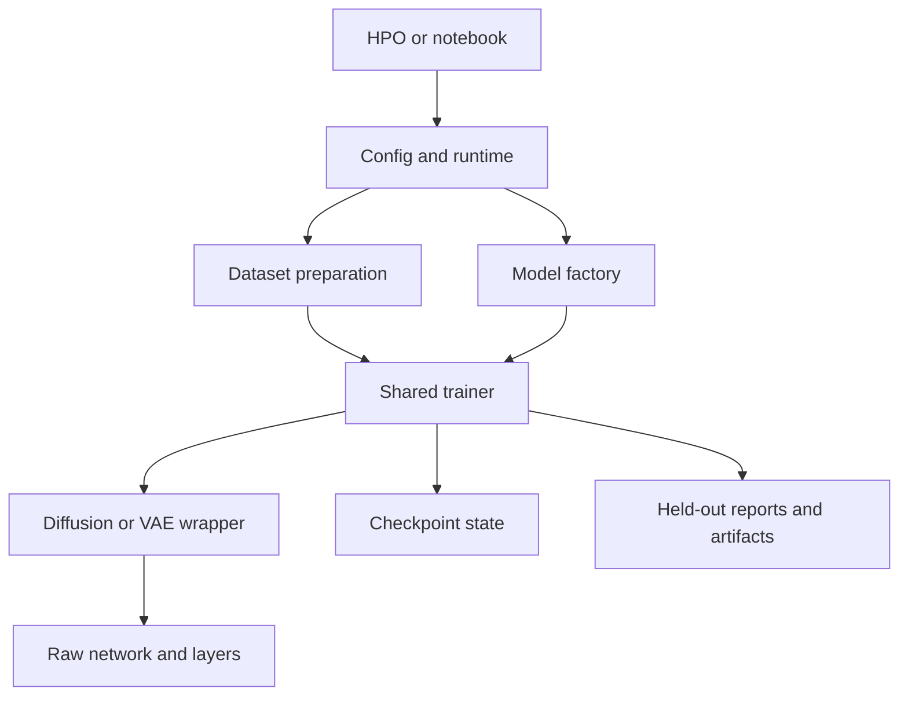

# Project component map

This guide describes how the maintained TensorFlow implementation fits together.
Start experiments through the shared orchestration APIs so label conventions,
preprocessing, optimizer ownership, reporting, and recovery stay aligned.
See [README](README.md) for examples and the
[compatibility guide](compatibility_migration.md) for supported boundaries.

## 🧭 Experiment flow

`common.train.main` configures seeds and Keras policy before dataset/model
construction. `get_datasets` provides batched data for ordinary training or a
callable six-array loader for continual learning. `get_model` builds a model or
classifier/generator bundle. `train_model` dispatches ordinary, progressive,
V2 phase, teacher, or continual fitting; `report` consumes the resulting history
and model using the same label, dtype, and branch conventions.

HPO saves trial configurations and calls this pipeline. The coordinator alone
owns Optuna storage; parallel workers own independent TensorFlow processes.
The named joint-classifier profile binds its declared numeric search ranges
to the same settings used for sampling. Scientific source identities and search
versions belong to the saved experiment; changing source does not authorize
rewriting the identity of earlier measurements.

## 🔁 Continual and semantic phases

The learner owns original-to-dense label mappings, completed-task teachers,
replay exposure, task results, and checkpoints. Diffusion wrappers own noisy
inputs, losses, gradients, EMA, sampling, and their random streams. Raw networks
own tensor transformations and feature/head routing. Semantic controllers attach
to existing learner boundaries, acquire class-specific modulations with frozen
base representations, then transfer targets into the deployed classifier.
The scientific objective definitions and adaptations are documented in
[SCIENTIFIC_BASIS](semantic_consolidation/SCIENTIFIC_BASIS.md).

## 📐 Contracts between components

| Boundary | Contract |
| --- | --- |
| Images | Ordinary loaders document their pixel transform; diffusion inputs are NHWC in the selected floating policy. Fixed byte-pixel transforms and fitted train-only statistics are distinct options. Never apply both loader and wrapper scaling twice. |
| Labels | Dataset class IDs, dense scheduled classifier columns, and CFG embedding IDs are different namespaces. With CFG, embedding ID 0 is null and real conditions are shifted; ordinary class targets stay unshifted. Wrapper preprocessing and teacher adapters own conversion. |
| Teachers | Completed-task and current-task teachers are independent frozen prediction sources during student updates. Explicit teacher fitting controls their trainable lifecycle. Class maps bind output columns to the student's vocabulary. |
| V2 phases | Generator and classifier have independent variable selections/optimizers. Epoch stopping controls use phase-specific metrics and state. A combined report explicitly evaluates both phases. |
| Mixed precision | Compute and variable dtypes may differ. Stable loss reductions and probability heads use the declared stable dtype. LossScaleOptimizer owns an inner optimizer; schedule controls act on that inner rate. |
| Randomness | Global initialization, named sampling/corruption streams, dataset shuffling, and replay selection are separate concerns. Seeded report contexts restore owned counters; seeded results also depend on batching and model configuration. |
| Growth | Wrapper reconstruction owns class expansion; supported persistent depth growth goes through the stage container and wrapper optimizer/EMA refresh. Raw post-build variable creation is not interchangeable with these APIs. |
| Recovery | A weight file is insufficient for exact training continuation. Native checkpoints authenticate topology, task schedule, replay, optimizer, RNG, callbacks and external payloads before restoration. |
| History | Shared fitting retains observed per-metric epochs through ordinary, progressive and V2 histories. Scheduled semantic block histories own their dense coordinates and NaN gaps. Explicit coordinates are needed after raw sparse-history serialization; observer state is recoverable. |
| Measurements | Accuracy matrices use completed training tasks as rows and evaluated tasks as columns. Missing scores remain unavailable. Aggregate forgetting is signed as documented; complete independent streams are the paired analysis units. |
| Test reuse | Explicit official-test validation is recorded as such and is not an independent held-out test estimate. Frozen designs bind their data split and executable source before execution. |

## 🗂️ Production module index

The following inventory covers maintained Python sources outside test directories.
Each linked module provides class/function-level contracts, including private
helpers. Package initializers describe lazy exports and serialization registration.
The role text is taken from the module's own documentation, keeping this index
consistent with the actual source rather than inventing a second API.

| Module | Responsibility |
| --- | --- |
| [__main__.py](__main__.py) | Repository-root command-line entry point for configuration-driven training. |
| [autoencoder/__init__.py](autoencoder/__init__.py) | Lazy autoencoder API with canonical Keras deserialization registration. |
| [autoencoder/vae_classifier.py](autoencoder/vae_classifier.py) | Joint conditional variational autoencoder and classifier model. |
| [autoencoder/variational_autoencoder.py](autoencoder/variational_autoencoder.py) | Dense variational autoencoder with optional class conditioning and replay. |
| [common/argument_saver.py](common/argument_saver.py) | Keras serialization mixins that retain constructor arguments. |
| [common/callbacks/decoder_accuracy.py](common/callbacks/decoder_accuracy.py) | Epoch callback for measuring the class fidelity of VAE generations. |
| [common/callbacks/hpo_guard.py](common/callbacks/hpo_guard.py) | Stop numerically divergent fits without ranking finite HPO candidates. |
| [common/callbacks/lr_logger.py](common/callbacks/lr_logger.py) | Record an optimizer's effective learning rate in Keras epoch logs. |
| [common/callbacks/plateau_lr.py](common/callbacks/plateau_lr.py) | Plateau controls for mutable rates and a monotonically advancing cosine clock. |
| [common/config.py](common/config.py) | Typed experiment configuration, schedule resolution, and safe YAML persistence. |
| [common/continual_reporting.py](common/continual_reporting.py) | Compute continual metrics and export learner details as CSV and TensorBoard. |
| [common/current_task_teacher.py](common/current_task_teacher.py) | Construct independent native teachers for one continual task's new classes. |
| [common/dataloader.py](common/dataloader.py) | MNIST/CIFAR loading, preprocessing, limiting, and TensorFlow dataset helpers. |
| [common/experiment.py](common/experiment.py) | Define reproducible paired-stream experiments and analyze final run outcomes. |
| [common/gradients.py](common/gradients.py) | Apply policy-aware gradients in custom TensorFlow training steps. |
| [common/hpo.py](common/hpo.py) | Persistent Optuna optimization through the shared Config training pipeline. |
| [common/hpo_process.py](common/hpo_process.py) | Small process and lock helpers for a single Optuna coordinator. |
| [common/hpo_profiles.py](common/hpo_profiles.py) | Explicit, bounded recipes layered on the common HPO configuration API. |
| [common/hpo_worker.py](common/hpo_worker.py) | Train one saved HPO configuration in a fresh TensorFlow process. |
| [common/keras_compat.py](common/keras_compat.py) | Small Keras 3 bridges shared by project models and diagnostics. |
| [common/keras_registry.py](common/keras_registry.py) | Register lazy and canonical Keras custom objects for project deserialization. |
| [common/learner.py](common/learner.py) | Class-incremental experiment orchestration shared by Config and HPO APIs. |
| [common/masked_loss.py](common/masked_loss.py) | Serializable MAE/MSE losses for comparing predictions with target prefixes. |
| [common/mechanistic.py](common/mechanistic.py) | Mechanistic and replay-quality measurements for continual experiments. |
| [common/model.py](common/model.py) | Construct, compile, initialize, and copy the project's model families. |
| [common/random.py](common/random.py) | Checkpointed random streams for TensorFlow graphs and XLA compilation. |
| [common/recovery.py](common/recovery.py) | Atomic task-boundary recovery primitives for continual experiments. |
| [common/replay_buffer.py](common/replay_buffer.py) | Manage continual-learning replay storage, candidate sampling, and cache reuse. |
| [common/replay_diagnostics.py](common/replay_diagnostics.py) | Post-generation measurements for image replay candidate pools. |
| [common/replay_preview.py](common/replay_preview.py) | Display generated replay without changing training pools or random streams. |
| [common/result_directory.py](common/result_directory.py) | Reserve independent new-run result directories with atomic collision handling. |
| [common/runtime.py](common/runtime.py) | Process-wide reproducibility and numeric-policy setup for experiments. |
| [common/study_artifacts.py](common/study_artifacts.py) | Source and completed-run integrity shared by the ordinary research studies. |
| [common/tensor_inventory.py](common/tensor_inventory.py) | Count shared live tensor payloads without importing an experimental route. |
| [common/train.py](common/train.py) | Orchestrate Config/direct-mode dataset loading, training, and reporting. |
| [common/utils.py](common/utils.py) | Plot experiment outputs, extract features, and persist samples or search logs. |
| [common/validation.py](common/validation.py) | Provide optimization-invariant assertion semantics for project invariants. |
| [diffusion/__init__.py](diffusion/__init__.py) | Lazy public API for diffusion networks, wrappers, layers, and schedules. |
| [diffusion/callbacks/batch_loss_plateau.py](diffusion/callbacks/batch_loss_plateau.py) | Batch-granularity early stopping for progressive training stages. |
| [diffusion/callbacks/image_generator.py](diffusion/callbacks/image_generator.py) | Epoch-end diffusion sampling, image plotting, and denoising GIF output. |
| [diffusion/callbacks/raw_network_validation.py](diffusion/callbacks/raw_network_validation.py) | Epoch-end validation against raw rather than EMA diffusion weights. |
| [diffusion/layers/adaptive_layer_normalization_zero.py](diffusion/layers/adaptive_layer_normalization_zero.py) | Conditioned, zero-initialized adaptive layer-normalization primitives. |
| [diffusion/layers/base_layer.py](diffusion/layers/base_layer.py) | Shared factories for condition-aware normalization and feed-forward layers. |
| [diffusion/layers/block/di_t_decoder_block.py](diffusion/layers/block/di_t_decoder_block.py) | Decoder block combining causal self-attention and cross-attention. |
| [diffusion/layers/block/vision_transformer_block.py](diffusion/layers/block/vision_transformer_block.py) | Condition-adaptive vision-transformer residual blocks. |
| [diffusion/layers/convolution/__init__.py](diffusion/layers/convolution/__init__.py) | Reusable channels-last convolution layers for diffusion networks. |
| [diffusion/layers/convolution/downsample.py](diffusion/layers/convolution/downsample.py) | Channels-last image downsampling layers for convolutional networks. |
| [diffusion/layers/convolution/residual_block.py](diffusion/layers/convolution/residual_block.py) | Condition-aware residual convolution blocks for image feature maps. |
| [diffusion/layers/convolution/stage.py](diffusion/layers/convolution/stage.py) | Trackable mapping container for depth-wise Keras layers. |
| [diffusion/layers/convolution/upsample.py](diffusion/layers/convolution/upsample.py) | Channels-last image upsampling layers for convolutional networks. |
| [diffusion/layers/convolution/variational_reshaper.py](diffusion/layers/convolution/variational_reshaper.py) | Functional flatten/unflatten models with an optional variational latent. |
| [diffusion/layers/drop_path.py](diffusion/layers/drop_path.py) | Stochastic-depth regularization for complete residual paths. |
| [diffusion/layers/embedding/__init__.py](diffusion/layers/embedding/__init__.py) | Public type contracts shared by diffusion embedding layers. |
| [diffusion/layers/embedding/base_embedding.py](diffusion/layers/embedding/base_embedding.py) | Base utilities for learned and sinusoidal token embeddings. |
| [diffusion/layers/embedding/condition_embedding.py](diffusion/layers/embedding/condition_embedding.py) | Discrete timestep and class-condition embedding layers. |
| [diffusion/layers/embedding/patch_embedding.py](diffusion/layers/embedding/patch_embedding.py) | Convert image feature maps into transformer patch-token sequences. |
| [diffusion/layers/feature_handler.py](diffusion/layers/feature_handler.py) | Selection, merging, normalization, and projection of saved features. |
| [diffusion/layers/manipulation/downsample.py](diffusion/layers/manipulation/downsample.py) | Spatial downsampling for flattened square token grids. |
| [diffusion/layers/manipulation/local_mixer.py](diffusion/layers/manipulation/local_mixer.py) | Depthwise-convolutional local mixing for transformer token sequences. |
| [diffusion/layers/manipulation/upsample.py](diffusion/layers/manipulation/upsample.py) | Spatial upsampling for flattened square token grids. |
| [diffusion/layers/policy_multi_head_attention.py](diffusion/layers/policy_multi_head_attention.py) | Retain float64 attention-scale precision with native Keras attention. |
| [diffusion/layers/single_token_layer.py](diffusion/layers/single_token_layer.py) | Learned or input-provided single-token embeddings. |
| [diffusion/metrics/ensemble_accuracy.py](diffusion/metrics/ensemble_accuracy.py) | Accumulate class accuracy after averaging diffusion-timestep predictions. |
| [diffusion/models/convolution/__init__.py](diffusion/models/convolution/__init__.py) | Public convolutional diffusion model exports and shared tensor aliases. |
| [diffusion/models/convolution/unet.py](diffusion/models/convolution/unet.py) | Hierarchical convolutional diffusion network with depth-indexed features. |
| [diffusion/models/convolution/unet_classifier.py](diffusion/models/convolution/unet_classifier.py) | Convolutional denoiser with classifier and optional distillation heads. |
| [diffusion/models/transformer/__init__.py](diffusion/models/transformer/__init__.py) | Shared public type aliases for diffusion-transformer network APIs. |
| [diffusion/models/transformer/di_t_classifier.py](diffusion/models/transformer/di_t_classifier.py) | Diffusion transformer with an attached feature-based classifier branch. |
| [diffusion/models/transformer/di_t_decoder.py](diffusion/models/transformer/di_t_decoder.py) | Decoder-style diffusion transformer with explicit encoder-context routing. |
| [diffusion/models/transformer/di_t_encoder_decoder.py](diffusion/models/transformer/di_t_encoder_decoder.py) | Composite diffusion network with a transformer encoder and DiT decoder. |
| [diffusion/models/transformer/di_t_encoder_decoder_classifier.py](diffusion/models/transformer/di_t_encoder_decoder_classifier.py) | Joint encoder-decoder denoiser with the standard DiT classifier API. |
| [diffusion/models/transformer/diffusion_transformer.py](diffusion/models/transformer/diffusion_transformer.py) | Configurable diffusion-transformer noise-prediction network. |
| [diffusion/models/wrapper/__init__.py](diffusion/models/wrapper/__init__.py) | Share wrapper selectors and topology-aware copying for diffusion networks. |
| [diffusion/models/wrapper/diffusion_classifier.py](diffusion/models/wrapper/diffusion_classifier.py) | Joint diffusion-and-classification training wrapper. |
| [diffusion/models/wrapper/diffusion_classifier_v2.py](diffusion/models/wrapper/diffusion_classifier_v2.py) | Separate generator and discriminator optimization for diffusion classifiers. |
| [diffusion/models/wrapper/diffusion_model.py](diffusion/models/wrapper/diffusion_model.py) | Training, evaluation, EMA, noising, and sampling for raw diffusion networks. |
| [diffusion/schedulers.py](diffusion/schedulers.py) | Diffusion noise schedules. |
| [init.py](init.py) | Set notebook import paths from the repository root without loading a backend. |
| [notebooks/hpo/generate_notebooks.py](notebooks/hpo/generate_notebooks.py) | Build the task/model matrix of thin configuration-driven HPO notebooks. |
| [notebooks/init.py](notebooks/init.py) | Shared checkout and runtime setup for standalone repository notebooks. |
| [notebooks/setup_cell.py](notebooks/setup_cell.py) | Prepare a notebook checkout and runtime before importing scientific packages. |
| [notebooks/thesis/bootstrap.py](notebooks/thesis/bootstrap.py) | Prepare a hosted notebook before importing TensorFlow or project modules. |
| [notebooks/thesis/completion.py](notebooks/thesis/completion.py) | Validate and recover completion bookkeeping using saved native evidence only. |
| [notebooks/thesis/development.py](notebooks/thesis/development.py) | Small saved-only validation review of one stream; no training or prediction. |
| [notebooks/thesis/init.py](notebooks/thesis/init.py) | Load shared notebook path setup when starting in this directory. |
| [notebooks/thesis/presentation.py](notebooks/thesis/presentation.py) | Small notebook views of existing measurements; no training or prediction. |
| [notebooks/thesis/reference_benchmarks.py](notebooks/thesis/reference_benchmarks.py) | Offline and naive references using the thesis DiT and native training APIs. |
| [notebooks/thesis/results_package.py](notebooks/thesis/results_package.py) | Saved-only, stream-first evidence package for the minimum Route One chapter. |
| [notebooks/thesis/workflow.py](notebooks/thesis/workflow.py) | Notebook staging of existing Route One APIs; no new training or metric logic. |
| [semantic_consolidation/__init__.py](semantic_consolidation/__init__.py) | Isolated semantic modulation consolidation built on the common project APIs. |
| [semantic_consolidation/__main__.py](semantic_consolidation/__main__.py) | Command-line entry point for complete route-one continual streams. |
| [semantic_consolidation/augmentation.py](semantic_consolidation/augmentation.py) | Stateless TensorFlow image augmentation from TMCL, Appendix A. |
| [semantic_consolidation/config.py](semantic_consolidation/config.py) | Validated route-one controls layered on the project's ordinary Config API. |
| [semantic_consolidation/controller.py](semantic_consolidation/controller.py) | Three-phase task-boundary orchestration and mechanism diagnostics. |
| [semantic_consolidation/controls.py](semantic_consolidation/controls.py) | Materialize the existing mechanistic controls as executable paired runs. |
| [semantic_consolidation/diagnostics.py](semantic_consolidation/diagnostics.py) | Bounded held-out probes; these measurements never participate in training. |
| [semantic_consolidation/evaluate.py](semantic_consolidation/evaluate.py) | Evaluate a saved cognitive-route checkpoint without retraining. |
| [semantic_consolidation/evaluation.py](semantic_consolidation/evaluation.py) | Fixed-checkpoint inference controls shared by both cognitive routes. |
| [semantic_consolidation/experimental.py](semantic_consolidation/experimental.py) | Section 11 observation at existing route boundaries; no training objective. |
| [semantic_consolidation/experimental_diagnostics.py](semantic_consolidation/experimental_diagnostics.py) | Section-11 held-out hidden probes and class-conditioned generated-memory audit. |
| [semantic_consolidation/extensions.py](semantic_consolidation/extensions.py) | Integrate review section 10 at the two existing routes' sample/fit boundaries. |
| [semantic_consolidation/fit_recovery.py](semantic_consolidation/fit_recovery.py) | Optional optimizer-step recovery using the existing compiled Keras training step. |
| [semantic_consolidation/memory.py](semantic_consolidation/memory.py) | Temporary affine control and class-balanced sampling for route one. |
| [semantic_consolidation/model.py](semantic_consolidation/model.py) | A fit-boundary adapter that retains the existing joint model and learner. |
| [semantic_consolidation/objectives.py](semantic_consolidation/objectives.py) | Numerical objectives for semantic modulation acquisition and consolidation. |
| [semantic_consolidation/phases.py](semantic_consolidation/phases.py) | Acquisition and consolidation using the platform's existing semantic head. |
| [semantic_consolidation/provenance.py](semantic_consolidation/provenance.py) | Record executable source identity and the numerical runtime for thesis runs. |
| [semantic_consolidation/recovery.py](semantic_consolidation/recovery.py) | Plain semantic checkpoint state encoded by the existing common serializer. |
| [semantic_consolidation/replay_selection.py](semantic_consolidation/replay_selection.py) | Matched-view replay selection shared by the two optional thesis routes. |
| [semantic_consolidation/runner.py](semantic_consolidation/runner.py) | End-to-end route-one execution through the shared project pipeline APIs. |
| [semantic_consolidation/scheduling.py](semantic_consolidation/scheduling.py) | Budgeted current acquisition and replay phases using the existing fit API. |
| [semantic_consolidation/study.py](semantic_consolidation/study.py) | Prepare, run, and analyze paired route-one streams with common.experiment. |
| [test.py](test.py) | Repository self-test registry and Python source contract inspection. |

## 🧪 Tests, notebooks, configuration and stored data

| Area | Responsibility and validation scope |
| --- | --- |
| [common/tests](common/tests) | Data/configuration, training, replay/teachers, growth, precision, HPO, metrics, serialization, recovery, process and source-contract regressions. |
| [semantic_consolidation/tests](semantic_consolidation/tests) | Objective numerics/gradients, phase ownership, memory, replay, schedules, saved-checkpoint inference, experimental controls and recovery. Truly optional absent research routes are skipped explicitly. |
| [notebooks/thesis/tests](notebooks/thesis/tests) | Startup without premature framework imports, frozen recipes, stream leases/recovery, reference fits, artifact collection and campaign semantics. |
| [autoencoder/tests](autoencoder/tests) | VAE input-boundary regression cases; embedded model self-tests are also registered in test.py. |
| [test.py](test.py) | Static documentation/type/comment contracts plus explicit embedded class-self-test registry. Unit discovery and notebook validation are separate checks. |
| [notebooks](notebooks/README.md) | Shared startup and example research workflows; [thesis notebooks](notebooks/thesis/README.md) orchestrate development, frozen benchmarks and collection. |
| [files/configs](files/configs/README.md) | Ordinary YAML configurations consumed by common.config; semantic configs have their own adapter and typed settings. |
| [files/data](files/data/README.md), [files/models](files/models/README.md), [files/results](files/results/README.md) | Data, trained state and measured artifacts. |
| [requirements.txt](requirements.txt), [.devcontainer](.devcontainer/README.md), [Docker commands](DOCKER_COMMANDS.md) | Dependency pins, optional container setup and environment operation. An existing verified notebook container is reused for checks. |

Documentation and source checks cover interfaces and structure. Benchmark
convergence and generality require the declared experiments.
