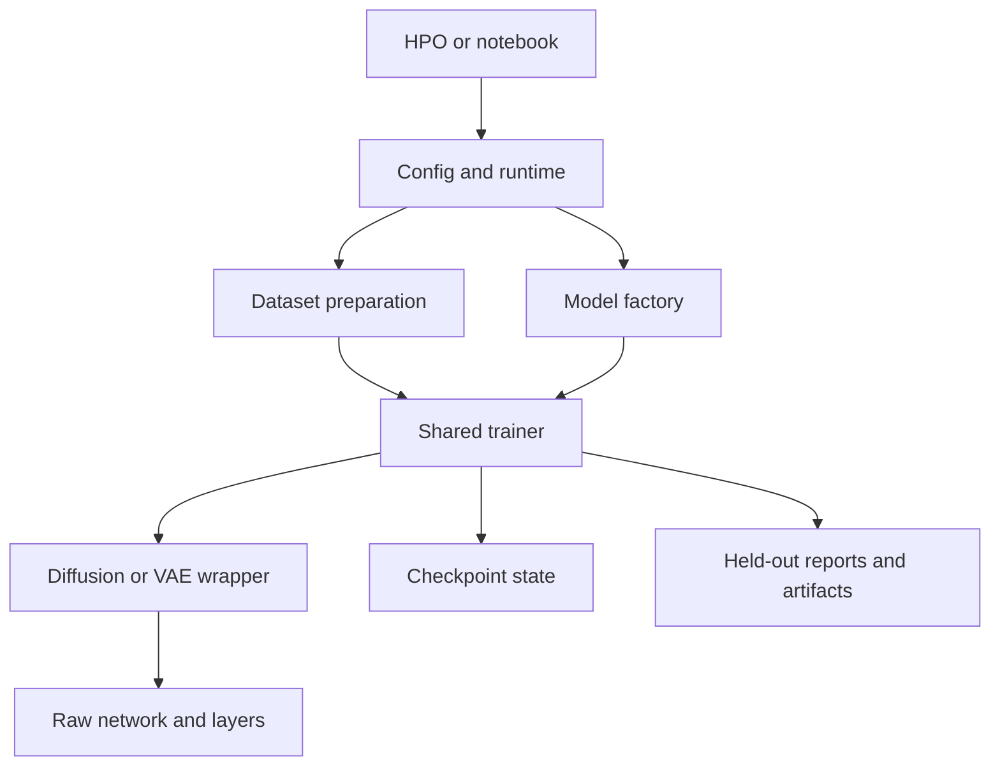
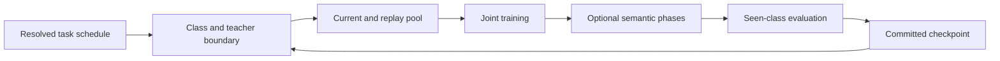

# Continual learning with Diffusion Vision Transformers

This TensorFlow 2.20 / Keras 3 research codebase combines two related workflows:

- class-incremental CIFAR learning with ordinary fine-tuning, replay-buffer
  rehearsal, or conditional-VAE generative replay; and
- conditional image diffusion with configurable transformer/U-Net networks,
  optional joint classification, EMA evaluation, classifier-free guidance,
  sampling, and training curricula over timesteps or resolution.

The [component map](#project-component-map) explains ownership, cross-component tensor
contracts, and every maintained production module. The
[compatibility guide](compatibility_migration.md) describes supported
growth and recovery boundaries.

The code is organized as importable research modules rather than a published
Python package. Run scripts and notebooks from the repository root so imports
such as `from diffusion import DiffusionModel` resolve consistently.

The root CLI loads a YAML configuration without training by default, or runs
the configured experiment with `--train`:

```powershell
python . files/configs/default.yaml
python . --train files/configs/default.yaml
```

Use `python . --help` for the complete command contract. The repository root
has no importable package initializer, so the CLI uses `python .` rather than a
root-package `python -m` target and the entry point uses absolute imports.
Individual `autoencoder.*` and `diffusion.*` modules can still be run with
`python -m`; their package-level public re-exports are loaded and cached lazily
so a target module is not imported twice during registered Keras self-tests.
Lazy Keras registry proxies also let package-only imports restore registered
Keras models as their canonical Python classes.

## Contents

- [Environment](#environment)
- [TensorFlow Docker command guide](#tensorflow-docker-command-guide)
- [How the diffusion API fits together](#how-the-diffusion-api-fits-together)
- [Configuration-driven experiments](#configuration-driven-experiments)
- [Hyperparameter optimization](#hyperparameter-optimization)
- [Class-incremental learning](#class-incremental-learning)
- [Semantic consolidation](#semantic-consolidation)
- [Directory guide](#directory-guide)
- [Project component map](#project-component-map)
- [Validation](#validation)

## Environment

### Run in a hosted notebook

Open the notebook, connect to a **GPU** runtime, then choose **Runtime > Run all**.
The first cell downloads the repository if needed and prepares TensorFlow 2.20.0
and Keras 3.11.2 before importing the project. An existing checkout is reused.
Each maintained thesis notebook has its own Colab button.

All notebooks use a small loader for the shared [files/notebooks/init.py](files/notebooks/init.py).
It reuses local source or downloads missing source using the canonical GitHub name,
`Continual-Learning-with-Diffusion-Vision-Transformers`. See the
[initializer guide](files/notebooks/INITIALIZATION.md) for details.

Kaggle is also detected automatically: import a notebook, enable Internet and
select a GPU, then Run all. Missing source is downloaded under `/kaggle/working`.
Binder has a CPU build configuration for small checks. For other compatible
hosted Jupyter services, set `RUNTIME = "hosted"` and select `CUDA` in the first cell.

See the [hosted runtime guide](files/notebooks/thesis/README.md#hosted-runtimes) for
provider setup, saved results, and the test-informed benchmark campaign's prerequisites.

### Local environment

Use TensorFlow **2.20.0** with native **Keras 3** and the TensorFlow backend.
Install the declared dependencies with:

```sh
python -m pip install -r requirements.txt
```

The same `requirements.txt` serves local environments, Docker, and hosted notebooks.
TensorFlow 2.20.0 and Keras 3.11.2 are pinned; compatible ranges for supporting
packages allow Colab and Kaggle to retain their managed kernel dependencies. The
[development container](.devcontainer/README.md) installs this file on the
official TensorFlow 2.20 GPU image. On Linux x86_64 (including WSL2 and Docker),
the file requests `tensorflow[and-cuda]`; other platforms use plain TensorFlow.
Notebook startup reads this same file and omits the CUDA extra for Colab/Kaggle
managed libraries and Binder CPU use. Use the startup cell: direct `pip -r` cannot
detect notebook providers and would include the CUDA extra. GPU use still requires a compatible
NVIDIA driver on the host.
See the [container guide](.devcontainer/README.md) for the maintained runtime
and the [common API guide](common/README.md) for supported checkpoint recovery.

GPU memory growth is configured by the container. After preparing dependencies,
call `common.utils.init()` to set the working directory to the checkout root, add
the root and thesis helpers to the import path, and import TensorFlow. See the
[local initialization example](common/README.md#local-initialization).
Project hierarchy names use `__`; `get_variables_names()` and
`common.keras_compat.format_variable_name()` display full variable paths using
that separator. Native Keras/TF paths still use their framework separators.

## TensorFlow Docker command guide

Copy and run the subsection you need in **Windows PowerShell**. These commands
are a reference, not a script to execute from top to bottom.

### 1. Create the container once

Open PowerShell in the project folder before running this block. `$PWD.Path`
becomes the container's `/workspace` mount, and `$env:USERPROFILE` resolves your
Windows user directory. Each continuation backtick must be the last character
on its line, with no trailing spaces.

Docker Desktop must be running with Linux containers and GPU support. The image
must already exist locally because this command uses `--pull=never`. The name
`tf_env_220` and host ports 8888, 6006, and 8080 must be available.

~~~powershell
New-Item -ItemType Directory -Force -Path "$env:USERPROFILE\.keras" | Out-Null

docker run -d `
  --name tf_env_220 `
  --pull=never `
  --gpus all `
  --init `
  --restart unless-stopped `
  --stop-timeout=60 `
  --shm-size=5g `
  --log-driver=json-file `
  --log-opt max-size=10m `
  --log-opt max-file=3 `
  -p 127.0.0.1:8888:8888 `
  -p 127.0.0.1:6006:6006 `
  -p 127.0.0.1:8080:8080 `
  --mount "type=bind,source=$($PWD.Path),target=/workspace" `
  --mount "type=bind,source=$env:USERPROFILE\.keras,target=/root/.keras" `
  --mount "type=bind,source=C:\,target=/mnt/c" `
  --mount "type=volume,source=tf_pip_cache,target=/root/.cache/pip" `
  --workdir /workspace `
  -e TF_FORCE_GPU_ALLOW_GROWTH=true `
  -e PYTHONUNBUFFERED=1 `
  tensorflow/full-tensorflow:2.20.0-gpu-jupyter `
  jupyter lab `
  --ip=0.0.0.0 `
  --port=8888 `
  --no-browser `
  --allow-root `
  --ServerApp.root_dir=/workspace `
  --ServerApp.port_retries=0
~~~

The pip cache volume is created automatically if needed. The command applies
no container-specific RAM cap; Docker Desktop/WSL and available host resources
still limit memory. `--shm-size=5g` sets the capacity of `/dev/shm` without
allocating all 5 GiB immediately.

| Windows resource | Container location |
| --- | --- |
| Project folder used at creation | `/workspace` |
| Current user's `.keras` folder | `/root/.keras` |
| C drive, with read/write access | `/mnt/c` |
| Docker volume `tf_pip_cache` | `/root/.cache/pip` |

Jupyter's file browser starts at `/workspace`. Access `/mnt/c` through Python or
a container terminal. See [Docker bind mounts](https://docs.docker.com/engine/storage/bind-mounts/),
[volumes](https://docs.docker.com/engine/storage/volumes/), and
[memory settings](https://docs.docker.com/engine/containers/resource_constraints/).

### 2. Start an existing container

Use this on later visits if the container is stopped:

~~~powershell
docker start tf_env_220
~~~

Check its status and published ports:

~~~powershell
docker ps -a --filter name=^/tf_env_220$
docker port tf_env_220
~~~

`docker run` creates a new container; `docker start` reuses the saved one and its
configuration. [Docker start documentation](https://docs.docker.com/reference/cli/docker/container/start/)

### 3. Get the Jupyter link and check access

Show the current server URL, including its login token when token authentication
is enabled:

~~~powershell
docker exec tf_env_220 jupyter server list
~~~

Alternatively, read the recent startup logs:

~~~powershell
docker logs --tail 50 tf_env_220
~~~

Open [JupyterLab](http://127.0.0.1:8888/lab). Use the token from the current server
listing if the login page asks for it. If a printed URL contains the container
hostname or `0.0.0.0`, replace that host with `127.0.0.1` and preserve the token.

Check that the Jupyter login page responds; a healthy response is normally 200:

~~~powershell
(Invoke-WebRequest -Uri "http://127.0.0.1:8888/login" -UseBasicParsing).StatusCode
~~~

To follow server logs continuously:

~~~powershell
docker logs --follow --tail 50 tf_env_220
~~~

Press **Ctrl+C** to stop following the logs; the container keeps running.
The commands above retrieve the current token instead of saving one in this file.
[Jupyter server URLs and tokens](https://jupyter-server.readthedocs.io/en/stable/operators/security.html)

### 4. Start TensorBoard

Run this in a separate PowerShell terminal:

~~~powershell
docker exec -it -w /workspace tf_env_220 tensorboard --logdir=/workspace/files/results --host=0.0.0.0 --port=6006
~~~

Open [TensorBoard](http://127.0.0.1:6006). Leave that terminal open while using
TensorBoard; **Ctrl+C** stops this TensorBoard process.

The project's default result trees sit under `files/results`. Ordinary training must
enable `training.tensorboard` to write TensorBoard logs. If you configured a
different `training.tensorboard_path` or result directory, change `--logdir` to
the matching path inside the container.

For HPO-only logs, use this alternative instead of the command above:

~~~powershell
docker exec -it -w /workspace tf_env_220 tensorboard --logdir=/workspace/files/results/hpo/_tb --host=0.0.0.0 --port=6006
~~~

Start only one TensorBoard process on port 6006 at a time. Port publishing makes
the service reachable after you start it. TensorBoard launched with `docker exec`
must be started again after the container restarts.

Repository references: [results layout](files/results/README.md),
[default configuration](files/configs/default.yaml), and
[training log configuration](common/train.py).
[TensorBoard guide](https://www.tensorflow.org/tensorboard/get_started)

### 5. Run commands inside the container

Open an interactive Bash terminal in the project:

~~~powershell
docker exec -it -w /workspace tf_env_220 bash
~~~

Type `exit` to leave that shell. The container and Jupyter keep running.

Run a single command from PowerShell:

~~~powershell
docker exec -w /workspace tf_env_220 ls -lah
~~~

Run your own Python script; replace the example path with your script's path:

~~~powershell
docker exec -w /workspace tf_env_220 /usr/bin/python ./path/to/your_script.py
~~~

For several lines of Python, this PowerShell here-string avoids nested quoting
problems. It runs in a separate Python process:

~~~powershell
@'
import sys
import tensorflow as tf
import keras


print("Python:", sys.version)
print("TensorFlow:", tf.__version__)
print("Keras:", keras.__version__)
print("GPUs:", tf.config.list_physical_devices("GPU"))
'@ | docker exec -i -w /workspace tf_env_220 /usr/bin/python -
~~~

Run these commands while the container is running.
[Docker exec documentation](https://docs.docker.com/reference/cli/docker/container/exec/)

### 6. Check GPU, resources, packages, and mounts

GPU and driver status:

~~~powershell
docker exec tf_env_220 nvidia-smi
~~~

One snapshot of container CPU and memory usage:

~~~powershell
docker stats --no-stream tf_env_220
~~~

Shared-memory capacity and current usage:

~~~powershell
docker exec tf_env_220 df -h /dev/shm
~~~

Image and bind/volume mounts:

~~~powershell
docker inspect tf_env_220 --format '{{.Config.Image}}'
docker inspect tf_env_220 --format '{{json .Mounts}}'
~~~

Dependency consistency and pip cache information:

~~~powershell
docker exec tf_env_220 /usr/bin/python -m pip check
docker exec tf_env_220 /usr/bin/python -m pip cache info
~~~

GPU discovery and package checks establish only those specific checks.
Repository compatibility requires the relevant tests to pass.
[Docker resource statistics](https://docs.docker.com/reference/cli/docker/container/stats/)

### 7. Run repository tests when needed

First inspect the image/mounts using section 6 and verify that `/workspace` points
to this exact checkout. Select tests appropriate to the change. These commands
use separate Python processes so tests do not reset the live notebook kernel's
Keras or random-number state.

Common tests:

~~~powershell
docker exec -w /workspace tf_env_220 /usr/bin/python -m unittest discover -s common/tests -t .
~~~

Semantic consolidation tests:

~~~powershell
docker exec -w /workspace tf_env_220 /usr/bin/python -m unittest discover -s semantic_consolidation/tests
~~~

Complete source-contract and embedded model self-test registry; this can be
substantial work:

~~~powershell
docker exec -w /workspace tf_env_220 /usr/bin/python common/test.py
~~~

See [compatibility notes](compatibility_migration.md) for remaining limitations.
Keep Python assertions enabled when running these tests.

### 8. Use the spare port 8080

For example, serve result files through a temporary HTTP server:

~~~powershell
docker exec -it -w /workspace tf_env_220 /usr/bin/python -m http.server 8080 --bind 0.0.0.0 --directory /workspace/files/results
~~~

Open [the result file server](http://127.0.0.1:8080). **Ctrl+C** stops it.
For your own application, configure it to listen on `0.0.0.0:8080` inside the
container. This mapping publishes TCP traffic to the Windows loopback interface.
[Docker port publishing](https://docs.docker.com/engine/network/port-publishing/)

### 9. Stop or restart intentionally

Save notebooks and training checkpoints first. These commands end running
notebook kernels and other container processes.

Stop:

~~~powershell
docker stop --timeout 60 tf_env_220
~~~

Restart:

~~~powershell
docker restart --timeout 60 tf_env_220
~~~

After starting again, retrieve the current Jupyter URL with `jupyter server list`
as shown in section 3, and relaunch TensorBoard if needed.
[Docker shutdown behavior](https://docs.docker.com/reference/cli/docker/container/stop/)

### 10. What persists

- Files in `/workspace` and the C-drive mount are stored on Windows.
- The Keras cache is stored in the current user's Windows `.keras` folder.
- Pip downloads are stored in the named Docker volume `tf_pip_cache`.
- Packages installed inside the container survive stop/start and restart.
  Removing/replacing the container discards its installed-package changes unless
  they have been incorporated into an image. A pip cache stores downloads.
- Changing this guide does not change a container that already exists.

For a later configuration change, preserve needed container changes before
replacing it. The existing container should be reused for routine work.
[Container storage](https://docs.docker.com/engine/containers/run/#filesystem-mounts)

## How the diffusion API fits together

```text
(clean image, class ID)
          |
          v
DiffusionModel / DiffusionClassifier wrapper
  schedule + noising + losses + optimizer + EMA + sampler
          |
          v
DiffusionTransformer / DiTClassifier / UNet / UNetClassifier raw network
  embeddings -> depth 1..N blocks -> prediction heads
          |
          v
reusable layers (attention, residual convolution, routing, scaling, embeddings)
```

The raw architectures in `diffusion/models/transformer/` and
`diffusion/models/convolution/` implement tensor transformations. The wrappers
in `diffusion/models/wrapper/` own the diffusion process and Keras lifecycle.
Compile and fit the wrapper; call the raw network only with already prepared
noisy images, timestep IDs, and embedding-label IDs.

### Minimal diffusion model

```python
import tensorflow as tf

from diffusion import DiffusionModel, DiffusionTransformer


network = DiffusionTransformer(
    num_classes=10, 
    use_cfg=True, 
    timesteps=1_000, 
    image_size=28, 
    channels=1, 
    patch_size=2, 
    dim=64, 
    depth=4 
)
model = DiffusionModel(
    network=network, 
    scheduler_name="clipped_cosine", 
    test_steps=50, 
    test_cfg_scale=4.0 
)
model.compile(
    optimizer=tf.keras.optimizers.Adam(1e-3), 
    loss="mse"
)

# Dataset elements: float images [B, 28, 28, 1] scaled to [-1, 1],
# paired with zero-based integer class IDs [B].
# model.fit(dataset, epochs=20)

# With CFG, sampling IDs are already shifted: 0 is null and 1..10 are classes.
samples = model.sample(labels=[1, 2, 3], steps=50, scale=4.0)
```

`DiTClassifier` or `UNetClassifier` plus `DiffusionClassifier` adds a
classifier branch and joint classification loss. `DiffusionClassifierV2`
separates generator and classifier variable groups/optimizers. Their READMEs
define the branch state, progressive-depth behavior, and variable-selection
IDs.

`DiffusionClassifierV2` requires CFG. Its classifier-only train/test timestep
caps use clean timestep 0 for `None`, the full horizon for `-1`, or an exclusive
`[0, cap)` range for a positive value; this range is independent of any active
progressive generator interval. Direct evaluation must select
`test_part="generator"` or `"discriminator"`, call a phase-specific evaluator,
or use `eval_both=True`. Shared reporting requests both phases.

Transformer classifiers can also prepend a distillation token after the class
token. `DiffusionClassifier` maps `tf.data.Dataset` batches through a frozen
teacher, supports hard cross-entropy or soft KL targets, and reports the class,
distillation, and coefficient-combined accuracies. See the
[transformer token contract](diffusion/models/transformer/README.md#class-and-distillation-tokens)
and [wrapper training contract](diffusion/models/wrapper/README.md#distillation-training)
for the exact output keys, coefficients, and dataset limitations.

### Architectural depth and routed IDs

For transformer models, depth `0` is the patch-embedded input before any stage.
For `UNet`, depth `0` is the projected image concatenated with broadcast time
and label embeddings. In both families, depths `1..N` are outputs of the
tracked `layers_dicts`, and `full_return=True` exposes the aligned feature and
regularizer lists. An `*_ids_dict` maps a target depth to source depths, while
an `*_ids` sequence selects depths where a component is enabled. `None`
commonly expands to every eligible depth; negative IDs are normalized relative
to the final depth.

The standard convolutional hierarchy uses encoder residual stacks and
downsampling, a bottleneck, then upsampling with encoder skips. A variational
bottleneck is enabled without manually calculating depth IDs:

```python
from diffusion import UNet


vae_network = UNet(
    image_size=32, 
    channels=3, 
    widths=(32, 64, 96), 
    reshaper_kwargs={"add_kl": True, "latent_dim_ratio": [0.5]}
)
```

This configuration disables skips automatically so decoding cannot bypass the
latent. `latent_dim_ratio` is a list with exactly one positive entry for each
flatten/unflatten pair, ordered by ascending flatten depth; this
single-bottleneck example therefore has one entry. Omitting the list selects
full-width latents by default.

A transformer VAE decoded through `sample_vae(...)` can arrange all
adjacent pairs as one central bridge after real encoder computation and before
real decoder/up-sampling computation. This applies to both single-level and
multi-level bottlenecks. During training, a flatten-stage route
can select its encoder feature; sampling bypasses that route to inject the
matching latent. Decoder routes must then consume the corresponding stochastic
unflattened features instead of reaching around the bridge to pre-latent
encoder features.

Train the network through `DiffusionModel` with a nonzero `kl_loss_coef`, then
use `sample_vae(...)` to decode latent samples. Supported `add_depths(...)`
calls retain existing stages and append new ones through the stage container;
use wrapper growth to refresh optimizer and EMA ownership. Classifier depth
cannot grow from `clf_depth=0`. Class expansion uses the wrapper's existing
reconstruction path. See the
[convolution model guide](diffusion/models/convolution/README.md) for supported
construction specifications and the [diffusion guide](diffusion/README.md)
for growth boundaries.

### Schedules

```python
from diffusion.schedulers import ScheduleConfig, ScheduleKind, generate_sigmas
from diffusion import make_schedule


vp = make_schedule("linear", 1_000, beta_start=1e-4, beta_end=2e-2)
karras = generate_sigmas(ScheduleConfig(
    kind=ScheduleKind.KARRAS, 
    num_steps=50, 
    sigma_min=0.002, 
    sigma_max=80.0, 
    rho=7.0 
))
```

`make_schedule` returns beta, cumulative-alpha, signal/noise amplitude, sigma,
and normalized-time arrays. Use `generate_sigmas` directly for native VE or
Karras magnitudes and endpoint-sampled sub-VP marginal deviations; the
all-in-one helper reports a VP beta-equivalent curve.
`"sigmoid"` and `"logistic"` are distinct: sigmoid interpolates per-step beta
between `beta_start` and `beta_end`, while logistic shapes a decreasing
cumulative `alpha_bar` and derives beta from it. Both use `logistic_k` for
transition steepness.

## Configuration-driven experiments

`common.config` defines nested dataclasses and YAML serialization.
`common.train` supports MNIST, Fashion-MNIST, CIFAR-10, and CIFAR-100 plus every
end-to-end model family used by the project. Set `model.name` for the generic
path; leave it `null` to retain the original DiT/DiT-classifier behavior.

The public orchestration surface is intentionally small:

| Stage | API |
| --- | --- |
| Data | `common.dataloader.get_datasets(config)` |
| Model | `common.model.get_model(config)` |
| Training | `common.train.train_model(config, model, trainset, valset)` |
| Reporting | `common.train.report(config, history, model, trainset, valset)` |
| All stages | `common.train.main(config)` |
| Continual learning | `common.learner.continually_learn(config)` |
| HPO | `common.hpo.run_hpo(...)` |

See [`common/README.md`](common/README.md) for the concise API guide. Exact
configuration fields and compatibility keywords remain documented in the
corresponding dataclasses and function docstrings.

Feature persistence is non-pickling by default. Homogeneous numeric `.npy`
files remain ordinary NPY; heterogeneous numeric feature splits use ordered NPZ
content behind the same public `.npy` filename. Loading a legacy object-NPY
requires explicit `allow_pickle=True`, emits a security warning, and is only
appropriate for a trusted file that will immediately be re-saved in the safe
format.

```python
from common.config import load_config
from common.train import main


config = load_config("files/configs/default.yaml")
result = main(config)
print(result["results_path"])
```

Generic model-specific constructor options live in `model.kwargs`; diffusion
wrapper options live in `model.wrapper_kwargs`. Omitted fields keep defaults
and unknown typed-section fields are rejected.
`training.task` is normalized case-insensitively and must be `legacy`,
`generation`, `joint`, `classification`, or `continual`. A path-like
`training.results_path` is normalized to text; `None` is accepted only when all
active consumers can run without an artifact directory, including interactive
image display during training and disabled save/TensorBoard/checkpoint outputs.
Set `training.fit_method="fit_progressively"` with `training.stage_tasks` and
the desired stage controls to use the diffusion wrapper's existing progressive
trainer; the default `"fit"` path is unchanged.

## Hyperparameter optimization

The HPO runner exposes the supported search spaces through one API:

```python
from common.hpo import SEARCH_SPACES, run_hpo


study = run_hpo(
    task="generation", 
    model_name="unet", 
    dataset_name="CIFAR10", 
    n_trials=30, 
    epochs=50, 
    results_path="files/results/hpo", 
    fit_method="fit_progressively", 
    fit_kwargs={
        "stage_tasks": "timesteps_only", 
        "stages_num": 4, 
        "stage_epochs": 5, 
        "final_epochs": 5
    }
)
```

Each Optuna trial first writes and reloads a YAML config, then uses
`common.train` for data, construction, training, and reports. Trial directories
contain weights, resolved config, enabled plots/images/GIFs, CSVs, and objective
values. TensorBoard event filenames encode every optimized value and the event
itself records the full name/value mapping. Continual trials additionally log
every epoch under task/class/phase namespaces and write final validation/test
continual metrics. Joint models default to a two-objective Pareto study;
`objective_metrics` and matching `objective_directions` select one or more
other objectives. Continual objectives are read only from validation continual
metrics and default to maximizing `final_average_accuracy`.

VAE generation objectives compare fixed validation reconstruction MSE, and
diffusion objectives compare unweighted validation `noise_loss` (input
reconstruction MSE in swap mode). Sampled training losses and KL coefficients
do not change the scoring units. These are reconstruction/denoising proxies;
continual validation accuracy measures the usefulness of generated replay.

For a teacher-distilled class-incremental architecture search, use
`task="continual"`, `model_name="diffusion_classifier"`, and
`use_distillation=True`. This umbrella space conditionally searches the DiT,
encoder-decoder DiT, and U-Net classifier families together with their
optimizer, diffusion, distillation, and replay choices. Dataset, split, seed,
task schedule, training budget, and validation objective remain fixed across
trials so their scores stay comparable.

Study state, the sampler state, and per-trial continual task checkpoints are
resumable by passing the existing study directory to `resume_from`. The saved
study specification is checked before continuation, and a trial interrupted
inside a continual task restarts only that task from its preceding committed
boundary. Study summaries are mirrored to `trials.csv`. Dataset-specific study
directories prevent runs on CIFAR-10 and CIFAR-100 from sharing state.

## Class-incremental learning

`continually_learn` accepts either a complete `Config` or the original inputs
as direct keywords. Its default `task_size=1` begins with one class and adds one
class per task. Larger automatic tasks partition `class_order` by `task_size`;
`class_order_mode="random"` shuffles classes before grouping, while
`task_order_mode="random"` shuffles complete groups without changing their
contents. Explicit `task_groups` can define an exact grouped-class schedule.
Config mode builds the loader and model bundle through
`common.dataloader.get_datasets` and `common.model.get_model`; every classifier
and replay-model phase then uses the shared training and reporting APIs.

Use fixed pixel scaling for strict class-incremental experiments so preprocessing
does not fit statistics using future-class training examples. Freeze validation
choices before using the test set for final comparisons.

```python
from common.config import Config
from common.learner import continually_learn


config = Config(
    dataset={"name": "cifar10", "preprocess": "fixed-min-max"}, 
    model={"name": "cnn"}, 
    continually_learn={
        "seed": 42, 
        "task_size": 1, 
        "use_buffer": True, 
        "buffer_kwargs": {"strategy": "fifo"}, 
        "plot_results": True
    }, 
    training={
        "task": "continual", 
        "epochs": 20, 
        "dtype_policy": "mixed_float16", 
        "deterministic_ops": True
    }
)
accuracies = continually_learn(config)
```

Continual diffusion replay uses the same training selector and curriculum
fields. The curriculum is applied to each replay-model task; ordinary
classifier phases still use `training.epochs`.

When `continually_learn.use_distillation=True`, a diffusion classifier with a
distillation token trains task one as the student, then uses an independent
frozen snapshot of each completed `snapshot_network_name` branch (`"raw"` or
`"ema"`) as the next task's teacher. EMA snapshots require EMA to be enabled.
This works with ordinary or progressive fitting and with both V1 and V2
wrappers; HPO enables the same lifecycle with
`run_hpo(..., use_distillation=True)`.

`continually_learn.seed` is the authoritative master seed and is propagated to
the schedule, data, model/layer initialization, task shuffling, replay,
training, sampling, and ensemble noising. `training.dtype_policy` is installed
before construction and governs models, wrappers, layers, schedules, and
optimizers, including mixed-precision loss scaling. With task checkpointing
enabled explicitly, `resume_from` accepts a checkpoint root or committed
task directory and restores models, teachers, optimizers, replay, task cursor,
metrics, and RNG state. Use the run's immutable `input_config.yaml` for this
resume; `config.yaml` is the final artifact-resolved record. When
`reporting.save_csv=True`, task/epoch metrics,
accuracy matrices, schedule, and continual summaries are saved beside the
resolved config and enabled weights/plots/images/GIFs. If
`use_ensemble_accuracy=True`, the ensemble matrix is authoritative for the
reported continual metrics. Average forgetting is signed: the best score
before the final evaluation minus the final score, so positive backward
transfer appears as negative forgetting rather than being clipped to zero.

Ensemble evaluation selects `network_name="raw"|"ema"`. Its `"chunked"` and
`"batched"` computation modes implement the same aggregation;
with a seed, stateless per-timestep noising makes results invariant to mode,
chunk size, and unrelated prior random draws. An `"ema"` selection resolves to
the raw branch when EMA is disabled.

Fixed-buffer replay uses `buffer_kwargs["strategy"]`. `"fifo"` is the exact
historical default, retaining the newest examples. `"reservoir"` gives every
example offered to the buffer equal probability of occupying fixed memory, while
`"class_balanced"` divides feasible storage nearly equally among observed
classes and uses reservoir sampling within each class. Strategy counters,
class allocation state, retained samples, and the private RNG are restored from
task checkpoints, so resumed insertion follows the same stream as an
uninterrupted run.

The optional `continually_learn.optimizer_steps_per_epoch` control fixes the
number of updates for each active task-training phase by repeating only the
already-selected pool; its `null` default changes nothing. The named
`reservoir_er` baseline offers that complete current pool to Algorithm R,
whereas an explicit `strategy: reservoir` with `baseline: null` preserves the
`insert_num` sampled-insertion ablation.

Direct mode remains useful with an existing classifier template or runtime
model object:

```python
from common.dataloader import load_cifar10
from common.learner import continually_learn


accuracies = continually_learn(
    class_num=10, 
    load_dataset_fn=load_cifar10, 
    tuned_model_path="files/models/hyperas/cifar10_cnn_model_00.h5", 
    use_buffer=True, 
    buffer_kwargs={
        "maxlen": 10_000, 
        "sample_num": 1_000, 
        "insert_num": 1_000, 
        "seed": 42, 
        "strategy": "reservoir"
    } 
)
```

The `hp-tuned` template path keeps every learned non-output-layer weight and
replaces only the output head. With `use_loaded_opt=True`, the new model receives
a fresh optimizer reconstructed from the saved optimizer configuration; slots
and iteration state are not transferred, and an uncompiled saved model is
rejected. With it disabled, the supplied compile configuration is used.

Each task rebuilds its training and validation inputs as `tf.data.Dataset`
pipelines. Both training and test evaluation are reported through
`common.train`. Fixed-buffer and generative rehearsal are mutually exclusive.
Configured sample limits, shuffling, raw-image padding, and seed are preserved
inside the task loop. Typed replay models derive padded dimensions from the
dataset; fresh and restored continual diffusion constructors receive raw
`num_classes=None` and grow their class vocabulary as labels are observed.
`model.weights_path` initializes a continual VAE replay model, the incremental
classifier for classifier-only and buffer runs, or a continual diffusion model
when its paired config contains zero-based `seen_classes`. The wrapper restores the grown
topology before weight loading. Saving dynamic diffusion weights requires a
`Config` and always writes the paired `config.yaml`, even when ordinary config
saving was disabled.
See `common/README.md` for the orchestration guide and inspect
`help(continually_learn)` after importing it from `common.learner` for the
complete direct-key contract;
see
`autoencoder/README.md` for conditional labels, training, and generation.

## Semantic consolidation

The selected research direction is TMCL-inspired semantic consolidation on a
JDCL-inspired joint diffusion classifier. `semantic_consolidation` connects to
the shared configuration, learner, generated replay, and reporting code.

1. **Joint learning** updates the generator and classifier using current
   examples and the configured replay/distillation objectives.
2. **Acquisition** learns bounded affine semantic modulations while keeping
   the acquired backbone fixed.
3. **Consolidation** transfers stopped, modulated target representations into
   the ordinary classifier. Deployment uses the unmodulated classifier without
   labels or task identity.

The implementation is an adaptation: its supervised objectives, modulation
locations, generated replay, and phase ordering differ from the source papers.
Passing implementation tests establishes mechanics, not improved accuracy or
biological validity. See the [semantic module guide](semantic_consolidation/README.md)
and [scientific basis](semantic_consolidation/SCIENTIFIC_BASIS.md) for the exact
objectives, supported configurations, controls, and claim boundaries.

## Directory guide

Project artifacts live under `files/`: `configs/`, `data/`, `gifs/`, `models/`,
`notebooks/`, `others/`, `results/`, and `thesis/`. Run command examples from the repository
root. Notebook examples and thesis workflows live in `files/notebooks/`; source
directories such as `diffusion/models/` and `semantic_consolidation/configs/`
remain separate.
Frozen campaigns bind source-file hashes; reproducing them requires the matching source.

- [`common/`](common/README.md): configuration, datasets, continual learner,
  replay buffer, losses, callbacks, plotting, and the training pipeline.
- [`autoencoder/`](autoencoder/README.md): VAE and VAE-classifier models.
- [`diffusion/`](diffusion/README.md): schedules, models, layers, metrics, and
  callbacks.
- [`files/configs/`](files/configs/README.md): YAML configuration examples and schema use.
- [`files/data/`](files/data/README.md): pre-extracted CIFAR feature arrays.
- [`files/gifs/`](files/gifs/): saved animations.
- [`files/models/`](files/models/README.md): checkpoints and legacy model artifacts; this
  is not the `diffusion.models` source package.
- [`files/notebooks/`](files/notebooks/README.md): exploratory, archived, and HPO experiments.
- [`files/others/`](files/others/): supporting research figures and reference material.
- [`files/results/`](files/results/README.md): generated run artifacts and reports.
- [`files/thesis/`](files/thesis/): thesis drafts, references, and source documents.
- [`semantic_consolidation/`](semantic_consolidation/README.md): semantic modulation experiments.

Maintained Python sources require module, class, and callable docstrings,
parameter and return annotations, and comments explaining conditional branches.
The source checker enforces their presence; numerical and protocol regressions
check behavior separately.

## Project component map

This section describes how the maintained TensorFlow implementation fits together.
Start experiments through the shared orchestration APIs so label conventions,
preprocessing, optimizer ownership, reporting, and recovery stay aligned.
See [configuration-driven experiments](#configuration-driven-experiments) for
examples and the [compatibility guide](compatibility_migration.md) for supported boundaries.

### 🧭 Experiment flow



`common.train.main` configures seeds and Keras policy before dataset/model
construction. `get_datasets` provides batched data for ordinary training or a
callable six-array loader for continual learning. `get_model` builds a model or
classifier/generator bundle. `train_model` dispatches ordinary, progressive,
V2 phase, teacher, or continual fitting; `report` consumes the resulting history
and model using the same label, dtype, and branch conventions.

HPO saves trial configurations and calls this pipeline. The coordinator alone
owns Optuna storage; parallel workers own independent TensorFlow processes.
The named joint-classifier profile binds its declared numeric search ranges
to the same settings used for sampling. Scientific source identities and search
versions belong to the saved experiment; changing source does not authorize
rewriting the identity of earlier measurements.

### 🔁 Continual and semantic phases



The learner owns original-to-dense label mappings, completed-task teachers,
replay exposure, task results, and checkpoints. Diffusion wrappers own noisy
inputs, losses, gradients, EMA, sampling, and their random streams. Raw networks
own tensor transformations and feature/head routing. Semantic controllers attach
to existing learner boundaries, acquire class-specific modulations with frozen
base representations, then transfer targets into the deployed classifier.
The scientific objective definitions and adaptations are documented in
[SCIENTIFIC_BASIS](semantic_consolidation/SCIENTIFIC_BASIS.md).

### 📐 Contracts between components

| Boundary | Contract |
| --- | --- |
| Images | Ordinary loaders document their pixel transform; diffusion inputs are NHWC in the selected floating policy. Fixed byte-pixel transforms and fitted train-only statistics are distinct options. Never apply both loader and wrapper scaling twice. |
| Labels | Dataset class IDs, dense scheduled classifier columns, and CFG embedding IDs are different namespaces. With CFG, embedding ID 0 is null and real conditions are shifted; ordinary class targets stay unshifted. Wrapper preprocessing and teacher adapters own conversion. |
| Teachers | Completed-task and current-task teachers are independent frozen prediction sources during student updates. Explicit teacher fitting controls their trainable lifecycle. Class maps bind output columns to the student's vocabulary. |
| V2 phases | Generator and classifier have independent variable selections/optimizers. Epoch stopping controls use phase-specific metrics and state. A combined report explicitly evaluates both phases. |
| Mixed precision | Compute and variable dtypes may differ. Stable loss reductions and probability heads use the declared stable dtype. LossScaleOptimizer owns an inner optimizer; schedule controls act on that inner rate. |
| Randomness | Global initialization, named sampling/corruption streams, dataset shuffling, and replay selection are separate concerns. Seeded report contexts restore owned counters; seeded results also depend on batching and model configuration. |
| Growth | Wrapper reconstruction owns class expansion; supported persistent depth growth goes through the stage container and wrapper optimizer/EMA refresh. Raw post-build variable creation is not interchangeable with these APIs. |
| Recovery | A weight file is insufficient for exact training continuation. Native checkpoints authenticate topology, task schedule, replay, optimizer, RNG, callbacks and external payloads before restoration. |
| History | Shared fitting retains observed per-metric epochs through ordinary, progressive and V2 histories. Scheduled semantic block histories own their dense coordinates and NaN gaps. Explicit coordinates are needed after raw sparse-history serialization; observer state is recoverable. |
| Measurements | Accuracy matrices use completed training tasks as rows and evaluated tasks as columns. Missing scores remain unavailable. Aggregate forgetting is signed as documented; complete independent streams are the paired analysis units. |
| Test reuse | Explicit official-test validation is recorded as such and is not an independent held-out test estimate. Frozen designs bind their data split and executable source before execution. |

### 🗂️ Production module index

The following inventory covers maintained Python sources outside test directories.
Each linked module provides class/function-level contracts, including private
helpers. Package initializers describe lazy exports and serialization registration.
The role text is taken from the module's own documentation, keeping this index
consistent with the actual source rather than inventing a second API.

| Module | Responsibility |
| --- | --- |
| [__main__.py](__main__.py) | Repository-root command-line entry point for configuration-driven training. |
| [autoencoder/__init__.py](autoencoder/__init__.py) | Lazy autoencoder API with canonical Keras deserialization registration. |
| [autoencoder/vae_classifier.py](autoencoder/vae_classifier.py) | Joint conditional variational autoencoder and classifier model. |
| [autoencoder/variational_autoencoder.py](autoencoder/variational_autoencoder.py) | Dense variational autoencoder with optional class conditioning and replay. |
| [common/argument_saver.py](common/argument_saver.py) | Keras serialization mixins that retain constructor arguments. |
| [common/callbacks/decoder_accuracy.py](common/callbacks/decoder_accuracy.py) | Epoch callback for measuring the class fidelity of VAE generations. |
| [common/callbacks/hpo_guard.py](common/callbacks/hpo_guard.py) | Stop numerically divergent fits without ranking finite HPO candidates. |
| [common/callbacks/lr_logger.py](common/callbacks/lr_logger.py) | Record an optimizer's effective learning rate in Keras epoch logs. |
| [common/callbacks/plateau_lr.py](common/callbacks/plateau_lr.py) | Plateau controls for mutable rates and a monotonically advancing cosine clock. |
| [common/config.py](common/config.py) | Typed experiment configuration, schedule resolution, and safe YAML persistence. |
| [common/continual_reporting.py](common/continual_reporting.py) | Compute continual metrics and export learner details as CSV and TensorBoard. |
| [common/current_task_teacher.py](common/current_task_teacher.py) | Construct independent native teachers for one continual task's new classes. |
| [common/dataloader.py](common/dataloader.py) | MNIST/CIFAR loading, preprocessing, limiting, and TensorFlow dataset helpers. |
| [common/experiment.py](common/experiment.py) | Define reproducible paired-stream experiments and analyze final run outcomes. |
| [common/gradients.py](common/gradients.py) | Apply policy-aware gradients in custom TensorFlow training steps. |
| [common/hpo.py](common/hpo.py) | Persistent Optuna optimization through the shared Config training pipeline. |
| [common/hpo_process.py](common/hpo_process.py) | Small process and lock helpers for a single Optuna coordinator. |
| [common/hpo_profiles.py](common/hpo_profiles.py) | Explicit, bounded recipes layered on the common HPO configuration API. |
| [common/hpo_worker.py](common/hpo_worker.py) | Train one saved HPO configuration in a fresh TensorFlow process. |
| [common/keras_compat.py](common/keras_compat.py) | Small Keras 3 bridges shared by project models and diagnostics. |
| [common/keras_registry.py](common/keras_registry.py) | Register lazy and canonical Keras custom objects for project deserialization. |
| [common/learner.py](common/learner.py) | Class-incremental experiment orchestration shared by Config and HPO APIs. |
| [common/masked_loss.py](common/masked_loss.py) | Serializable MAE/MSE losses for comparing predictions with target prefixes. |
| [common/mechanistic.py](common/mechanistic.py) | Mechanistic and replay-quality measurements for continual experiments. |
| [common/model.py](common/model.py) | Construct, compile, initialize, and copy the project's model families. |
| [common/random.py](common/random.py) | Checkpointed random streams for TensorFlow graphs and XLA compilation. |
| [common/recovery.py](common/recovery.py) | Atomic task-boundary recovery primitives for continual experiments. |
| [common/replay_buffer.py](common/replay_buffer.py) | Manage continual-learning replay storage, candidate sampling, and cache reuse. |
| [common/replay_diagnostics.py](common/replay_diagnostics.py) | Post-generation measurements for image replay candidate pools. |
| [common/replay_preview.py](common/replay_preview.py) | Display generated replay without changing training pools or random streams. |
| [common/result_directory.py](common/result_directory.py) | Reserve independent new-run result directories with atomic collision handling. |
| [common/runtime.py](common/runtime.py) | Process-wide reproducibility and numeric-policy setup for experiments. |
| [common/study_artifacts.py](common/study_artifacts.py) | Source and completed-run integrity shared by the ordinary research studies. |
| [common/tensor_inventory.py](common/tensor_inventory.py) | Count shared live tensor payloads without importing an experimental route. |
| [common/test.py](common/test.py) | Repository self-test registry and Python source contract inspection. |
| [common/train.py](common/train.py) | Orchestrate Config/direct-mode dataset loading, training, and reporting. |
| [common/utils.py](common/utils.py) | Initialize notebook paths, plot outputs, extract features, and persist samples. |
| [common/validation.py](common/validation.py) | Provide optimization-invariant assertion semantics for project invariants. |
| [diffusion/__init__.py](diffusion/__init__.py) | Lazy public API for diffusion networks, wrappers, layers, and schedules. |
| [diffusion/callbacks/batch_loss_plateau.py](diffusion/callbacks/batch_loss_plateau.py) | Batch-granularity early stopping for progressive training stages. |
| [diffusion/callbacks/image_generator.py](diffusion/callbacks/image_generator.py) | Epoch-end diffusion sampling, image plotting, and denoising GIF output. |
| [diffusion/callbacks/raw_network_validation.py](diffusion/callbacks/raw_network_validation.py) | Epoch-end validation against raw rather than EMA diffusion weights. |
| [diffusion/layers/adaptive_layer_normalization_zero.py](diffusion/layers/adaptive_layer_normalization_zero.py) | Conditioned, zero-initialized adaptive layer-normalization primitives. |
| [diffusion/layers/base_layer.py](diffusion/layers/base_layer.py) | Shared factories for condition-aware normalization and feed-forward layers. |
| [diffusion/layers/block/di_t_decoder_block.py](diffusion/layers/block/di_t_decoder_block.py) | Decoder block combining causal self-attention and cross-attention. |
| [diffusion/layers/block/vision_transformer_block.py](diffusion/layers/block/vision_transformer_block.py) | Condition-adaptive vision-transformer residual blocks. |
| [diffusion/layers/convolution/__init__.py](diffusion/layers/convolution/__init__.py) | Reusable channels-last convolution layers for diffusion networks. |
| [diffusion/layers/convolution/downsample.py](diffusion/layers/convolution/downsample.py) | Channels-last image downsampling layers for convolutional networks. |
| [diffusion/layers/convolution/residual_block.py](diffusion/layers/convolution/residual_block.py) | Condition-aware residual convolution blocks for image feature maps. |
| [diffusion/layers/convolution/stage.py](diffusion/layers/convolution/stage.py) | Trackable mapping container for depth-wise Keras layers. |
| [diffusion/layers/convolution/upsample.py](diffusion/layers/convolution/upsample.py) | Channels-last image upsampling layers for convolutional networks. |
| [diffusion/layers/convolution/variational_reshaper.py](diffusion/layers/convolution/variational_reshaper.py) | Functional flatten/unflatten models with an optional variational latent. |
| [diffusion/layers/drop_path.py](diffusion/layers/drop_path.py) | Stochastic-depth regularization for complete residual paths. |
| [diffusion/layers/embedding/__init__.py](diffusion/layers/embedding/__init__.py) | Public type contracts shared by diffusion embedding layers. |
| [diffusion/layers/embedding/base_embedding.py](diffusion/layers/embedding/base_embedding.py) | Base utilities for learned and sinusoidal token embeddings. |
| [diffusion/layers/embedding/condition_embedding.py](diffusion/layers/embedding/condition_embedding.py) | Discrete timestep and class-condition embedding layers. |
| [diffusion/layers/embedding/patch_embedding.py](diffusion/layers/embedding/patch_embedding.py) | Convert image feature maps into transformer patch-token sequences. |
| [diffusion/layers/feature_handler.py](diffusion/layers/feature_handler.py) | Selection, merging, normalization, and projection of saved features. |
| [diffusion/layers/manipulation/downsample.py](diffusion/layers/manipulation/downsample.py) | Spatial downsampling for flattened square token grids. |
| [diffusion/layers/manipulation/local_mixer.py](diffusion/layers/manipulation/local_mixer.py) | Depthwise-convolutional local mixing for transformer token sequences. |
| [diffusion/layers/manipulation/upsample.py](diffusion/layers/manipulation/upsample.py) | Spatial upsampling for flattened square token grids. |
| [diffusion/layers/policy_multi_head_attention.py](diffusion/layers/policy_multi_head_attention.py) | Retain float64 attention-scale precision with native Keras attention. |
| [diffusion/layers/single_token_layer.py](diffusion/layers/single_token_layer.py) | Learned or input-provided single-token embeddings. |
| [diffusion/metrics/ensemble_accuracy.py](diffusion/metrics/ensemble_accuracy.py) | Accumulate class accuracy after averaging diffusion-timestep predictions. |
| [diffusion/models/convolution/__init__.py](diffusion/models/convolution/__init__.py) | Public convolutional diffusion model exports and shared tensor aliases. |
| [diffusion/models/convolution/unet.py](diffusion/models/convolution/unet.py) | Hierarchical convolutional diffusion network with depth-indexed features. |
| [diffusion/models/convolution/unet_classifier.py](diffusion/models/convolution/unet_classifier.py) | Convolutional denoiser with classifier and optional distillation heads. |
| [diffusion/models/transformer/__init__.py](diffusion/models/transformer/__init__.py) | Shared public type aliases for diffusion-transformer network APIs. |
| [diffusion/models/transformer/di_t_classifier.py](diffusion/models/transformer/di_t_classifier.py) | Diffusion transformer with an attached feature-based classifier branch. |
| [diffusion/models/transformer/di_t_decoder.py](diffusion/models/transformer/di_t_decoder.py) | Decoder-style diffusion transformer with explicit encoder-context routing. |
| [diffusion/models/transformer/di_t_encoder_decoder.py](diffusion/models/transformer/di_t_encoder_decoder.py) | Composite diffusion network with a transformer encoder and DiT decoder. |
| [diffusion/models/transformer/di_t_encoder_decoder_classifier.py](diffusion/models/transformer/di_t_encoder_decoder_classifier.py) | Joint encoder-decoder denoiser with the standard DiT classifier API. |
| [diffusion/models/transformer/diffusion_transformer.py](diffusion/models/transformer/diffusion_transformer.py) | Configurable diffusion-transformer noise-prediction network. |
| [diffusion/models/wrapper/__init__.py](diffusion/models/wrapper/__init__.py) | Share wrapper selectors and topology-aware copying for diffusion networks. |
| [diffusion/models/wrapper/diffusion_classifier.py](diffusion/models/wrapper/diffusion_classifier.py) | Joint diffusion-and-classification training wrapper. |
| [diffusion/models/wrapper/diffusion_classifier_v2.py](diffusion/models/wrapper/diffusion_classifier_v2.py) | Separate generator and discriminator optimization for diffusion classifiers. |
| [diffusion/models/wrapper/diffusion_model.py](diffusion/models/wrapper/diffusion_model.py) | Training, evaluation, EMA, noising, and sampling for raw diffusion networks. |
| [diffusion/schedulers.py](diffusion/schedulers.py) | Diffusion noise schedules. |
| [files/notebooks/hpo/generate_notebooks.py](files/notebooks/hpo/generate_notebooks.py) | Build the task/model matrix of thin configuration-driven HPO notebooks. |
| [files/notebooks/init.py](files/notebooks/init.py) | Shared checkout and runtime setup for standalone repository notebooks. |
| [files/notebooks/setup_cell.py](files/notebooks/setup_cell.py) | Prepare a notebook checkout and runtime before importing scientific packages. |
| [files/notebooks/thesis/bootstrap.py](files/notebooks/thesis/bootstrap.py) | Prepare a hosted notebook before importing TensorFlow or project modules. |
| [files/notebooks/thesis/completion.py](files/notebooks/thesis/completion.py) | Validate and recover completion bookkeeping using saved native evidence only. |
| [files/notebooks/thesis/development.py](files/notebooks/thesis/development.py) | Small saved-only validation review of one stream; no training or prediction. |
| [files/notebooks/thesis/init.py](files/notebooks/thesis/init.py) | Load shared notebook path setup when starting in this directory. |
| [files/notebooks/thesis/presentation.py](files/notebooks/thesis/presentation.py) | Small notebook views of existing measurements; no training or prediction. |
| [files/notebooks/thesis/reference_benchmarks.py](files/notebooks/thesis/reference_benchmarks.py) | Offline and naive references using the thesis DiT and native training APIs. |
| [files/notebooks/thesis/results_package.py](files/notebooks/thesis/results_package.py) | Saved-only, stream-first evidence package for the minimum Route One chapter. |
| [files/notebooks/thesis/workflow.py](files/notebooks/thesis/workflow.py) | Notebook staging of existing Route One APIs; no new training or metric logic. |
| [semantic_consolidation/__init__.py](semantic_consolidation/__init__.py) | Isolated semantic modulation consolidation built on the common project APIs. |
| [semantic_consolidation/__main__.py](semantic_consolidation/__main__.py) | Command-line entry point for complete route-one continual streams. |
| [semantic_consolidation/augmentation.py](semantic_consolidation/augmentation.py) | Stateless TensorFlow image augmentation from TMCL, Appendix A. |
| [semantic_consolidation/config.py](semantic_consolidation/config.py) | Validated route-one controls layered on the project's ordinary Config API. |
| [semantic_consolidation/controller.py](semantic_consolidation/controller.py) | Three-phase task-boundary orchestration and mechanism diagnostics. |
| [semantic_consolidation/controls.py](semantic_consolidation/controls.py) | Materialize the existing mechanistic controls as executable paired runs. |
| [semantic_consolidation/diagnostics.py](semantic_consolidation/diagnostics.py) | Bounded held-out probes; these measurements never participate in training. |
| [semantic_consolidation/evaluate.py](semantic_consolidation/evaluate.py) | Evaluate a saved cognitive-route checkpoint without retraining. |
| [semantic_consolidation/evaluation.py](semantic_consolidation/evaluation.py) | Fixed-checkpoint inference controls shared by both cognitive routes. |
| [semantic_consolidation/experimental.py](semantic_consolidation/experimental.py) | Section 11 observation at existing route boundaries; no training objective. |
| [semantic_consolidation/experimental_diagnostics.py](semantic_consolidation/experimental_diagnostics.py) | Section-11 held-out hidden probes and class-conditioned generated-memory audit. |
| [semantic_consolidation/extensions.py](semantic_consolidation/extensions.py) | Integrate review section 10 at the two existing routes' sample/fit boundaries. |
| [semantic_consolidation/fit_recovery.py](semantic_consolidation/fit_recovery.py) | Optional optimizer-step recovery using the existing compiled Keras training step. |
| [semantic_consolidation/memory.py](semantic_consolidation/memory.py) | Temporary affine control and class-balanced sampling for route one. |
| [semantic_consolidation/model.py](semantic_consolidation/model.py) | A fit-boundary adapter that retains the existing joint model and learner. |
| [semantic_consolidation/objectives.py](semantic_consolidation/objectives.py) | Numerical objectives for semantic modulation acquisition and consolidation. |
| [semantic_consolidation/phases.py](semantic_consolidation/phases.py) | Acquisition and consolidation using the platform's existing semantic head. |
| [semantic_consolidation/provenance.py](semantic_consolidation/provenance.py) | Record executable source identity and the numerical runtime for thesis runs. |
| [semantic_consolidation/recovery.py](semantic_consolidation/recovery.py) | Plain semantic checkpoint state encoded by the existing common serializer. |
| [semantic_consolidation/replay_selection.py](semantic_consolidation/replay_selection.py) | Matched-view replay selection shared by the two optional thesis routes. |
| [semantic_consolidation/runner.py](semantic_consolidation/runner.py) | End-to-end route-one execution through the shared project pipeline APIs. |
| [semantic_consolidation/scheduling.py](semantic_consolidation/scheduling.py) | Budgeted current acquisition and replay phases using the existing fit API. |
| [semantic_consolidation/study.py](semantic_consolidation/study.py) | Prepare, run, and analyze paired route-one streams with common.experiment. |

### 🧪 Tests, notebooks, configuration and stored data

| Area | Responsibility and validation scope |
| --- | --- |
| [common/tests](common/tests) | Data/configuration, training, replay/teachers, growth, precision, HPO, metrics, serialization, recovery, process and source-contract regressions. |
| [semantic_consolidation/tests](semantic_consolidation/tests) | Objective numerics/gradients, phase ownership, memory, replay, schedules, saved-checkpoint inference, experimental controls and recovery. Truly optional absent research routes are skipped explicitly. |
| [files/notebooks/thesis/tests](files/notebooks/thesis/tests) | Startup without premature framework imports, frozen recipes, stream leases/recovery, reference fits, artifact collection and campaign semantics. |
| [autoencoder/tests](autoencoder/tests) | VAE input-boundary regression cases; embedded model self-tests are also registered in common/test.py. |
| [common/test.py](common/test.py) | Static documentation/type/comment contracts plus explicit embedded class-self-test registry. Unit discovery and notebook validation are separate checks. |
| [notebooks](files/notebooks/README.md) | Shared startup and example research workflows; [thesis notebooks](files/notebooks/thesis/README.md) orchestrate development, frozen benchmarks and collection. |
| [files/configs](files/configs/README.md) | Ordinary YAML configurations consumed by common.config; semantic configs have their own adapter and typed settings. |
| [files/data](files/data/README.md), [files/models](files/models/README.md), [files/results](files/results/README.md) | Data, trained state and measured artifacts. |
| [requirements.txt](requirements.txt), [.devcontainer](.devcontainer/README.md), [Docker commands](#tensorflow-docker-command-guide) | Dependency pins, optional container setup and environment operation. An existing verified notebook container is reused for checks. |

Documentation and source checks cover interfaces and structure. Benchmark
convergence and generality require the declared experiments.

## Validation

Run the complete repository assessment from the repository root in the configured
TensorFlow environment:

```powershell
python common/test.py
```

This command first enforces the source-wide documentation, type-annotation,
and adjacent branch-comment contracts. It then discovers the
maintained model and layer classes and runs every registered TensorFlow
self-test. A missing class, an omitted self-test result, or any non-passing
result makes the command fail.

Run the orchestration, HPO, recovery, and continual-learning regressions too:

```powershell
python -m unittest discover -s common/tests -t .
python -m unittest discover -s semantic_consolidation/tests
```
