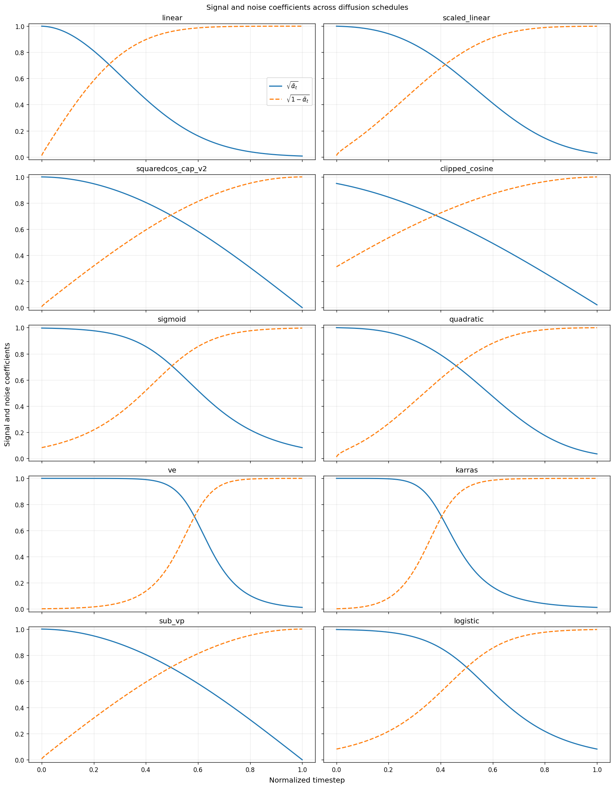
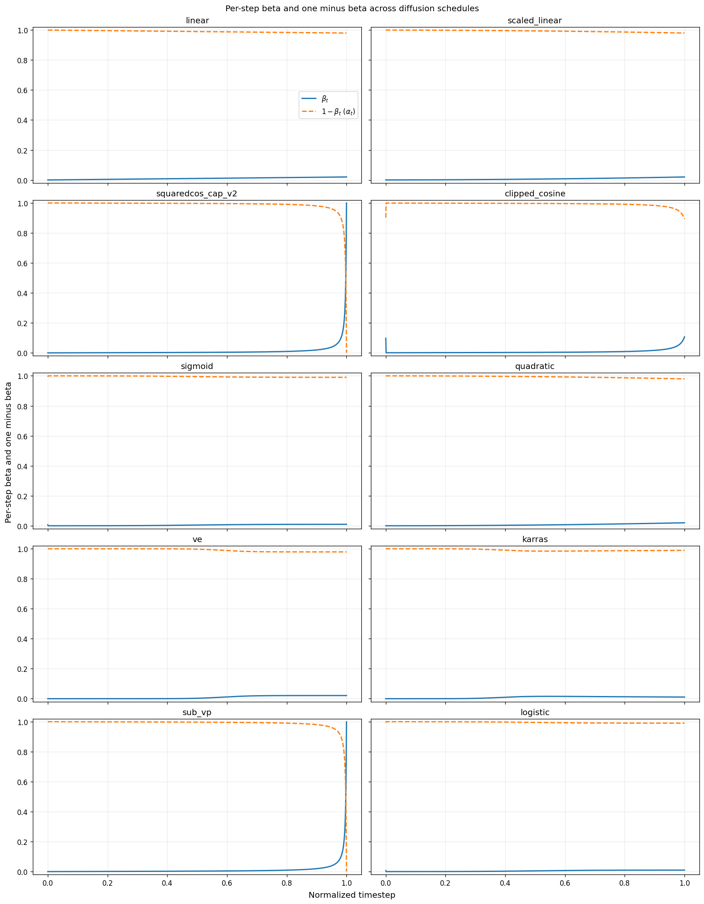
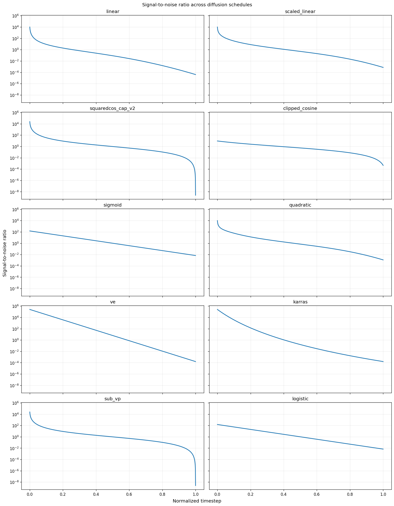
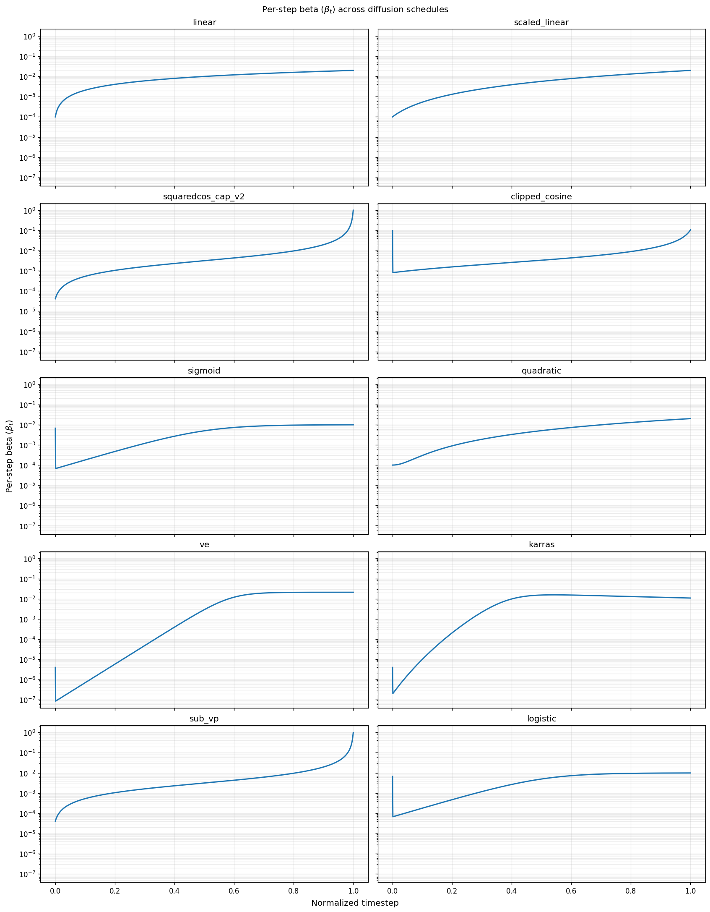
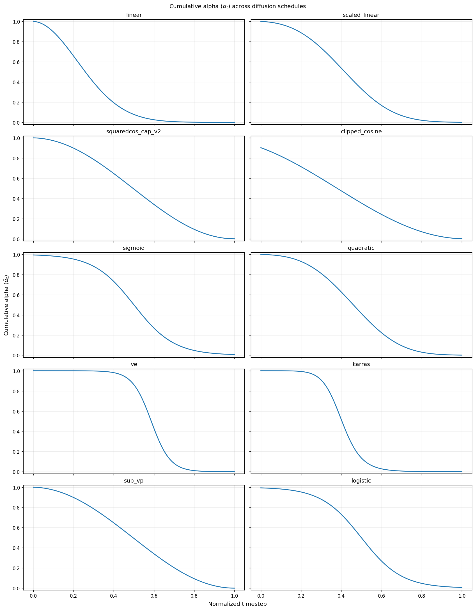
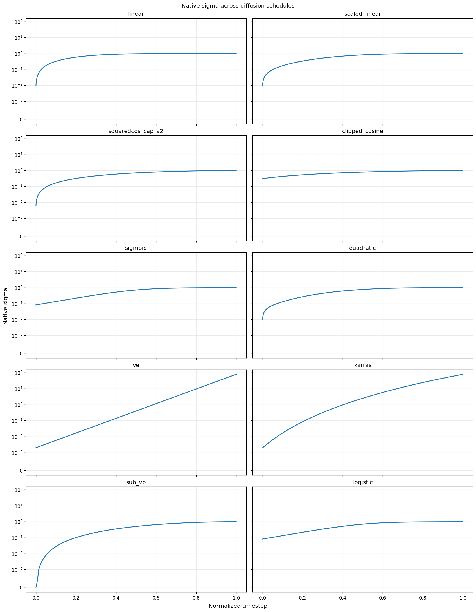

# Diffusion package

The `diffusion` package provides conditional image-diffusion architectures,
Keras training/sampling wrappers, reusable transformer and spatial layers,
noise schedules, callbacks, and metrics. The package targets TensorFlow 2.10
and uses channels-last image tensors.

Its existing package-level public exports are lazy and cached. Imports such as
`from diffusion import DiffusionModel, UNet` keep the same API while a plain
`import diffusion` avoids eagerly importing implementation modules. The package
installs lazy registry proxies for its Keras-serializable convolution objects,
so package-only `load_model(...)` resolves canonical classes while registered
submodules still run exactly once through `python -m`.

## Architecture and wrapper roles

The two model directories form one API boundary:

1. `models/transformer/` and `models/convolution/` define raw neural networks.
   They transform noisy images and conditions into predictions, but do not own
   the diffusion process.
2. `models/wrapper/` accepts a raw network and supplies schedule arrays,
   noising, classifier-free label masking, objectives, optimizer steps, EMA
   synchronization, Keras `train_step`/`test_step`, and reverse sampling.

Compile and train the wrapper. Inspect or call its `network` when direct raw
predictions are needed; use `ema_network` for the smoothed copy when EMA is
enabled. The model and wrapper READMEs document their complete input
dictionaries and state.

The raw `DiTEncoderDecoder` and `DiTEncoderDecoderClassifier` remain compatible
with their standard three-input wrapper workflows and use the noisy encoder
image as the decoder input. A four-input call may instead provide a distinct
teacher-forcing image. `DiffusionModel` uses the ordinary three-input wrapper
pipeline; the raw model reuses `x_t` for its decoder, so
training, evaluation, and sampling stay aligned and the target noise is never
exposed to the network.
Encoder-side progressive depth and decoder construction depth are owned
separately; see the transformer README for exact contracts.

## Basic conditional model

```python
import tensorflow as tf

from diffusion import DiffusionModel, DiffusionTransformer

network = DiffusionTransformer(
    num_classes=10, 
    use_cfg=True, 
    timesteps=1_000, 
    image_size=28, 
    channels=1, 
    patch_size=2, 
    dim=64, 
    depth=4, 
)
model = DiffusionModel(
    network, 
    scheduler_name="clipped_cosine", 
    test_steps=50, 
    test_cfg_scale=4.0, 
)
model.compile(optimizer=tf.keras.optimizers.Adam(), loss="mse")

# A dataset element is (images, class_ids): float [B, 28, 28, 1] in [-1, 1]
# and integer [B]. The wrapper prepares noisy images and shifted CFG IDs.
# model.fit(dataset, epochs=...)

images = model.sample(labels=[1, 2, 3], steps=50, scale=4.0)
```

When classifier-free guidance is active, wrappers reserve condition ID `0` as
the null label and shift real zero-based dataset labels to `1..num_classes`
during training. `sample(labels=...)` and direct raw-network calls consume
those already-shifted embedding IDs, so the example IDs generate real classes
0, 1, and 2. Without CFG, use the ordinary IDs `0..num_classes-1`.

## Convolutional model family

`UNet` follows the same depth-based raw-network contract as
`DiffusionTransformer`. Depth `0` is its projected image plus broadcast
timestep/label condition; every later depth is one tracked `LayerDict` in
`layers_dicts`. The standard hierarchy uses residual encoder stacks,
downsampling, a bottleneck, then upsampling with encoder skips. Its real
`full_return=True` result is
`(noise, condition, features_list, regs_list, z_vals)`.

Set a KL bottleneck directly on the model:

```python
import tensorflow as tf

from diffusion import DiffusionModel, UNet

network = UNet(
    image_size=32, 
    channels=3, 
    widths=(32, 64, 96), 
    reshaper_kwargs={"add_kl": True, "latent_dim_ratio": 0.5}, 
)
model = DiffusionModel(network, kl_loss_coef=1e-4)
model.compile(optimizer=tf.keras.optimizers.Adam(1e-3), loss="mse")
# model.fit(dataset, epochs=...)
images = model.sample_vae(labels=[1, 2], network_name="ema")
```

KL mode inserts the computed flatten/unflatten depths and disables skips by
default, ensuring the decoder cannot route around the latent. Ordinary U-Net
mode keeps the standard skip hierarchy. Both modes support active-resolution
changes and shape-preserving residual depth growth through `add_depths(...)`.

`UNetClassifier` adds a feature-based convolutional classifier while retaining
the denoising branch. It can be passed unchanged to `DiffusionClassifier` for
joint optimization or to `DiffusionClassifierV2` for separate generator and
classifier optimizers. Use a separate raw network instance for each wrapper.
The [convolution model guide](models/convolution/README.md) documents feature
routing, classifier returns, progressive branch growth, and training calls.

`DiffusionClassifierV2` requires CFG. Its classifier train/test noising caps
mean clean timestep 0 for `None`, the full horizon for `-1`, or an exclusive
`[0, cap)` draw for a positive cap; they do not inherit a progressive
generator's current lower bound. Call `evaluate_generator`,
`evaluate_discriminator`, `evaluate(test_part=...)`, or
`evaluate(eval_both=True)`; evaluating without a selected phase is rejected,
while `common.train.report` selects both. For continual
`distil_scope="replay_only"`, an explicit third replay-provenance tensor is
preserved through raw and mapped V2 discriminator batches so teacher-targeted
losses and their accuracy metric use replay rows only.

## Schedule API

```python
from diffusion import make_schedule

schedule = make_schedule(
    "clipped_cosine", 
    num_steps=1_000, 
    min_sqrt_alpha_bar=0.02, 
    max_sqrt_alpha_bar=0.95, 
)
```

`make_schedule` returns six `float64` NumPy arrays of shape `(num_steps,)`:
`betas`, `alpha_bar`, `sqrt_alpha_bar`, `sqrt_one_minus_alpha_bar`, `sigmas`,
and normalized `timesteps`. Supported names are `linear`, `scaled_linear`,
`squaredcos_cap_v2`, `clipped_cosine`, `sigmoid`, `quadratic`, `ve`, `karras`,
`sub_vp`, and `logistic`. See `schedulers.py` for every valid keyword and the
difference between native sigma-space and beta-equivalent outputs.
`sigmoid` directly interpolates per-step beta between `beta_start` and
`beta_end`; `logistic` instead shapes decreasing cumulative signal power
`alpha_bar` and converts it to beta. They share `logistic_k` as a steepness
control but are not aliases.

### Schedule comparisons

The figures below compare all supported schedules over 1,000 normalized
timesteps. Each figure uses shared axes across its ten panels. Standalone beta
and SNR use logarithmic y-axes, while native sigma uses a symmetric-log axis so
that both zero and the large VE/Karras ranges remain visible. Click a plot to
open it at full resolution.

<table>
<tr>
<td width="50%" valign="top"><a href="sqrt_alpha_bar_with_sqrt_one_minus_alpha_bar.png"></a><br><sub>Forward-process coefficients: <code>sqrt_alpha_bar</code> (signal) and <code>sqrt_one_minus_alpha_bar</code> (noise).</sub></td>
<td width="50%" valign="top"><a href="betas_with_one_minus_betas.png"></a><br><sub>Per-step noise and retained-signal factors: <code>betas</code> and <code>one_minus_betas</code> (<code>alphas</code>).</sub></td>
</tr>
<tr>
<td width="50%" valign="top"><a href="snr.png"></a><br><sub>Signal-to-noise ratio derived from <code>alpha_bar</code>.</sub></td>
<td width="50%" valign="top"><a href="betas.png"></a><br><sub>Per-step noise variance, <code>betas</code>.</sub></td>
</tr>
<tr>
<td width="50%" valign="top"><a href="alpha_bar.png"></a><br><sub>Cumulative retained-signal power, <code>alpha_bar</code>.</sub></td>
<td width="50%" valign="top"><a href="native_sigmas.png"></a><br><sub>Native noise scale, including VE/Karras magnitudes.</sub></td>
</tr>
</table>

Regenerate this focused set from the repository root with:

```python
from diffusion.schedulers import save_schedule_plots

save_schedule_plots(
    "diffusion",
    dpi=120,
    metrics=(
        "sqrt_alpha_bar_with_sqrt_one_minus_alpha_bar",
        "betas_with_one_minus_betas",
        "snr",
        "betas",
        "alpha_bar",
        "native_sigmas",
    ),
)
```

## Ensemble classifier accuracy

`EnsembleAccuracy` averages unconditional classifier predictions across
timesteps in either bounded-memory `"chunked"` or single-call `"batched"` mode.
Use `network_name="raw"|"ema"`; omitting it defaults to `"ema"`, which the
wrapper resolves to raw when EMA is disabled. With a seed, stateless noise is
derived per logical timestep, so
batched and chunked results are invariant to chunk size and prior RNG use.

## Package map

- `layers/`: patch/condition embeddings, DiT blocks, adaptive normalization,
  feature routing, stochastic depth, and reusable convolutional stages.
- `models/`: raw architectures and training/sampling wrappers.
- `callbacks/`: image generation, validation, and batch-loss control hooks.
- `metrics/`: ensemble classification accuracy.
- `schedulers.py`: NumPy schedule generation and conversion.
- `old/`: archived, non-public experiments retained for reproducibility.

The package root re-exports the supported high-level convolution API:

```python
from diffusion import (
    DiffusionClassifier, 
    DiffusionClassifierV2, 
    DiffusionModel, 
    ImageDownsample, 
    ImageUpsample, 
    LayerDict, 
    ResidualConvBlock, 
    ResidualConvStack, 
    UNet, 
    UNetClassifier, 
    VariationalReshaper, 
)
```

The same layers are available from `diffusion.layers.convolution`; the raw
models are also available from `diffusion.models.convolution`.
