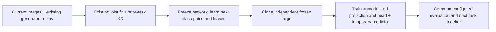

# Semantic modulation consolidation

This package adds class-specific temporary modulation and semantic consolidation
to the existing joint diffusion classifier. The shared learner still owns data
loading, class growth, generated replay, retention teachers and continual metrics.
The deployed classifier uses neither class gates nor a task-specific predictor.
[SCIENTIFIC_BASIS.md](SCIENTIFIC_BASIS.md) explains the objectives, source papers
and limits of the proposed mechanism.

Optional [phase scheduling, replay selection and inference controls](SECTION10.md)
are configured through `route.extensions`. Start with
`configs/extensions_smoke.yaml` or `configs/extensions_cifar10.yaml`.
Optional [held-out experimental diagnostics](EXPERIMENTAL_DIAGNOSTICS.md) add
fixed hidden-feature cohorts, generated-sample measurements, learning curves and
resource accounting through `route.experimental`. Omitting these mappings keeps
the three-phase method described below.

## Run

Install the root [requirements.txt](../requirements.txt), which targets
**TensorFlow 2.20**, and run these commands from the repository root:

```powershell
python -m semantic_consolidation --config semantic_consolidation/configs/smoke.yaml --dry-run
python -m semantic_consolidation --config semantic_consolidation/configs/smoke.yaml
python -m semantic_consolidation --config semantic_consolidation/configs/cifar10.yaml
python -m semantic_consolidation --config semantic_consolidation/configs/cifar100.yaml
```

Dataset downloads use the ordinary Keras loaders; cached datasets are reused.
`--dry-run` validates configuration without constructing models or loading data.

`smoke.yaml` uses real MNIST and two small experiences; it checks execution.
`cifar10.yaml` defines five two-class experiences; `cifar100.yaml` defines ten
ten-class experiences. Both are **development starting configurations**, with
validation-only evaluation and pools of 1,024 current/1,024 old replay rows per
later increment. Joint epochs and the semantic sampler revisit these rows;
the pool sizes are not total presentation counts. These are bounded exposure protocols, not full-data reference
benchmarks or validated hyperparameters. Set `replay_current_examples: null` to
expose all permitted current examples. State the exposure budget in thesis tables.

## What happens, step by step

1. `load_route_config` reads a normal common YAML with `common.config.load_config`
   and layers optional `common` overrides plus isolated `route` settings on top.
   Validation rejects settings outside the implemented protocol before training.
2. `common.dataloader.get_datasets` selects the standard loader. Fixed pixel
   scaling maps public byte values to `[-1,1]` without fitting statistics on
   future classes. `common.model.get_model` creates the usual joint DiT and its
   compiled optimizer. The adapter preserves those exact objects.
3. `common.train.train_model` runs the existing continual learner. It resolves
   class order, remaps original labels to introduction-order IDs, expands heads,
   generates old replay, and supplies the existing previous-task retention teacher.
   The first phase trains the original joint classifier and denoiser with their
   existing CE, classifier KD, and noise-KD controls.
4. Before joint `fit`, the adapter captures bounded clean validation features and
   old-gate behavior, after the common learner has expanded the class head.
   After joint `fit` completes, the adapter invokes `RouteController` before
   the learner evaluates or snapshots the completed task. The controller reads
   the same finite current/replay pool. It never retrieves historical training
   images outside this supplied pool.
5. Acquisition freezes all network weights and state. A seeded shuffled cycle
   selects new classes. Each update uses at least two positive examples and a
   balanced set of negative examples, without reusing an index within a batch.
   With `image_augmentation: tmcl`, each image is horizontally flipped with
   probability 0.5 before the configured acquisition diffusion noise is applied.
   **One selected-class gain/bias pair is applied to every row.** The separation
   loss attracts positive pairs and penalizes squared positive/negative cosine.
   Only that class's two independent variables are updated; old gates cannot
   drift through momentum. Short budgets explicitly report untrained classes.
6. A separate frozen copy of the acquired network becomes the consolidation
   target. Frozen copies of the modulation values produce its target features.
   The previous-task KD teacher remains separate and unchanged. In `tmcl` mode,
   student and target receive independent augmented views of matching images at
   the same diffusion level. In `none` mode, they receive the exact same
   image/noise tensor. Both use null conditioning.
7. Consolidation trains the **existing primary classifier projection and head**,
   plus a temporary predictor. The default loss is clean CE plus weighted,
   normalized instance InfoNCE against the frozen modulated target. Other batch
   indices are negatives, including same-class examples. The semantic loss
   averages over examples, target views and noise levels; bounded signal-retention weights
   affect only that term. Acquisition and CE have their own fixed noise-level
   controls. CE uses a separate image without geometric/color augmentation, so
   varying semantic views or noise bands does not also vary supervised inputs.
8. Reproducible mixed-class probes use a fixed subset of the permitted validation
   split. Each selected gate sees every probe batch. Hidden-to-target alignment
   and predictor-mediated alignment are recorded separately, alongside clean
   accuracy, calibration, class geometry, hidden CKA, variance and effective rank.
   Old-gate function is measured before joint training, after joint training and
   after consolidation on identical clean inputs; parameter hashes are separate.
   Hash checks enforce the frozen target, old bank, prior teacher, and default
   nonsemantic network boundaries. The learner then records the configured
   ordinary or ensemble task matrix and snapshots the **post-consolidation** model
   for the next task. The registered thesis recipes select ensemble accuracy.
9. Final inference uses null conditioning, all seen classes, and no modulator
   or predictor. Ordinary inference uses the primary classifier; ensemble
   inference combines the configured classifier heads and timesteps. The raw network and its
   saved weights retain the existing common API. Modulators are saved separately
   as numeric NPZ arrays for inspection; the predictor is discarded after its task.



The gain/bias bank uses `8 * seen_classes * projection_dimension` bytes in
float32. This excludes the student, previous teacher, additional consolidation
target, optimizer slots, predictor, replay pool, and allocator overhead, all of
which must be considered when describing memory use.

## Configure the mechanism

A route file can contain a normal common mapping directly, or reference a common
file with `base_config`. A base path is relative to the route file. Common model,
training, dataset, replay, and reporting settings keep their ordinary meanings.
Outputs and data paths retain the project's repository-working-directory convention.

```yaml
base_config: common_v1.yaml
common:
  training:
    results_path: ./results/my_semantic_experiment
route:
  condition: learned
  acquisition_steps: 100
  consolidation_steps: 100
  image_augmentation: tmcl
  augmentation_views: 4
  acquisition_noise_level: 0
  ce_noise_level: 0
  noise_levels: [0, 50, 150]
  reliability: alpha_bar
  reliability_floor: 0.05
  alignment_weight: 1.0
```

Level `0` means no diffusion noise, even if scheduler timestep zero has nonzero
noise. Geometric/color augmentation still applies when `image_augmentation: tmcl`.
Positive values index the platform's schedule. Choose these levels and coefficients
on validation data; `alpha_bar` is a bounded signal proxy, not calibrated semantic
confidence. `uniform` disables reliability downweighting.

| Settings | Meaning |
|---|---|
| `acquisition_steps`, `consolidation_steps` | Optimizer applications per task; independent of base joint epochs |
| `batch_size` | Maximum semantic batch; shrinks when positive classes have fewer examples |
| `learning_rate` | Fresh Adam rate for each semantic phase |
| `temperature`, `alignment_weight`, `ce_weight` | InfoNCE temperature and consolidation coefficients |
| `orthogonality_weight` | Positive weight of acquisition's squared cross-class cosine |
| `gain_limit`, `bias_limit`, `modulation_init_std` | Bounded affine controls and seeded initialization |
| `image_augmentation` | `tmcl` enables the image transforms below; `none` retains the original unaugmented behavior |
| `augmentation_views` | Total independent consolidation image views in `tmcl` mode; default 4, at least 2 |
| `acquisition_noise_level`, `ce_noise_level` | Separate fixed diffusion-noise controls; both default to no diffusion noise |
| `noise_levels`, `reliability`, `reliability_floor` | Semantic diffusion levels and bounded weights |
| `retain_modulators` | Retain old gates; false explicitly tests discarding them after consolidation |
| `probe_batches` | Validation-probe size target; at least two rows per represented class when available |
| `probe_max_gates` | Maximum measured gates per diagnostic, default 16; all gates if within the cap, otherwise a seeded old/new subset |
| `seed` | Semantic seed, defaulting to the common continual master seed |

The maintained CIFAR recipes explicitly select `image_augmentation: tmcl`.
`RouteSettings()` defaults to `none` to preserve direct-call behavior and provide
an explicit no-augmentation ablation. In `tmcl` mode, acquisition uses only random
horizontal flipping (probability 0.5). Consolidation uses random resized crops
to 32 x 32 with bicubic interpolation, scale `(0.08, 1.0)` and aspect ratio
`(0.75, 4/3)`; brightness/contrast/saturation/hue jitter `(0.4, 0.4, 0.2, 0.1)`
with probability 0.8 and random operation order; grayscale with probability 0.2;
and horizontal flipping with probability 0.5. Even-numbered views (2, 4, ...,
using the paper's one-based numbering) also apply solarization with probability
0.2, effective intensity threshold 0.5 and addition 0. This is the fixed
threshold represented by Kornia's `thresholds=0.0` argument. Image transforms
operate in `[0,1]` after converting the platform's nominal `[-1,1]` inputs.

The default four independent image views are drawn once per consolidation update,
before forward diffusion. The first is the student view; the other three are
frozen-target views. Matching image rows remain positives, and the existing
InfoNCE or feature-MSE loss is averaged over target views and diffusion levels.
View seeds derive from phase, committed step and view index, without mutable
augmentation RNG state, so checkpoint continuation can reproduce the draws.
In `none` mode the original paired noisy tensor is reused unchanged.

These transforms port the published [TMCL augmentation policy (Appendix A)](https://arxiv.org/html/2505.14125v3#A1)
to TensorFlow, including flips-only acquisition and even-numbered solarized
views. The author code differs in acquisition cropping and view ordering;
this is not code parity. The TensorFlow crop uses ten sampling attempts with a
center-crop fallback. Interpolation, crop sampling and backend numerics can
differ from Kornia; bicubic overshoot is not removed by extra final clipping.
They do not add the paper's separate view-invariance objective or reproduce its
backbone/consolidation algorithm; see [Appendix C](https://arxiv.org/html/2505.14125v3#A3)
and the [local scientific specification](SCIENTIFIC_BASIS.md).

The baseline YAML states all active base loss coefficients. Classifier KD uses
soft temperature-scaled teacher targets over full expanded student support and
explicit replay-row eligibility, intersected with the wrapper's CFG-null mask.
Original noise-KD masking remains unchanged. Acquisition and consolidation use
their balanced current/replay sampling distribution, with no teacher-KD loss
added during those frozen-denoiser phases. Inspect the resolved common config
for the full inherited settings and masks.

## Controls and paired experiments

| `condition` / setting | Intervention |
|---|---|
| `baseline` | Original joint platform; no extra phases |
| `extra_joint` | Spend acquisition + consolidation update count on additional original joint training |
| `learned` | Learn gates and consolidate with InfoNCE |
| `random` | Keep initialized gates; acquisition computes gradients at zero learning rate |
| `random` + `modulation_init_std: 0.0` | Exact identity modulation with the existing InfoNCE objective |
| `no_consolidation` | Learn gates; replace semantic transfer with the same number of CE updates |
| `feature_distillation` | Same modulated targets/predictor with normalized pointwise MSE |
| `unmodulated_feature_distillation` | Unmodulated frozen targets with pointwise MSE; acquisition is a compute control |
| `time_matched_joint` | Extra joint training stopped at a measured per-task time budget |
| `acquisition_objective: true_class_ce` | Explicit shortcut-prone per-row true-label conditioning control |
| `consolidation_scope: backbone` | Allow gradients into all connected classifier/shared-backbone variables |

`extra_joint`, learned, random, identity, feature-distillation and replacement-CE
controls match **optimizer applications** when their declared phase budgets match.
Random acquisition applications make no parameter change. Different affected
parameters, target passes, and noisy views have different cost. MSE is averaged
over feature dimensions and has a different scale from InfoNCE; give both the
same prespecified validation-selection process before making comparative claims.
Specify the candidate coefficient grids (allowing different scales), equal
selection budgets, validation criterion and tie-breaking rule before examining
comparison results. Equal numerical coefficients are not equal regularization
strength. No MSE/InfoNCE tuning was performed for these corrections.
`extra_joint` retains the original joint optimizer and its learning-rate schedule;
report those settings alongside the semantic phase optimizer. Use
`route_resources.csv:total_updates` for complete update counts. Common's optimizer
delta counts the joint optimizer (including extra joint updates), while semantic
optimizer applications are recorded in the route sidecars; do not add these
totals together and double-count joint work.

The semantic controls share their balanced phase sampler; additional joint
training uses ordinary common batches, which can have different sizes and
example presentation counts. Replacement CE has CE-only gradients but still
computes the unused semantic forwards/loss. Random and identity acquisition
compute gradients at zero learning rate. Report these differences, phase
example/noise draws, update counts and measured times; none is a FLOP match.

Executable standalone examples are in `configs/controls/`: `learned.yaml`,
`random.yaml`, `identity_infonce.yaml`, `ce_only.yaml`, and `extra_joint.yaml`.
For comparisons, materialize all five from one template with paired seeds,
class orders, data/replay settings and declared budgets:

```powershell
python -m semantic_consolidation.controls --config semantic_consolidation/configs/cifar10.yaml --output results/route_controls --seeds 17 29 43
python -m semantic_consolidation.study run --manifest results/route_controls/manifest.json
python -m semantic_consolidation.study analyze --manifest results/route_controls/manifest.json
```

Preparation does not train. Add `--timing-records <matching-pilot>/route_metrics.json`
to preparation only when measured learned allowances exist. The helper checks
task/phase budgets and writes `timing_basis.json` with source hash and summed
durations. Verify matching hardware and protocol from the pilot's configuration
and provenance; duration records alone cannot establish that match.

### Clean and noisy alignment controls

The CIFAR default uses no diffusion noise (`noise_levels: [0]`) while retaining
the configured `tmcl` image augmentation. Three additional standalone recipes
use the same learned treatment and phase budgets:

| File in `configs/controls/` | Diffusion levels | Reliability |
|---|---|---|
| `clean_uniform.yaml` | `[0]` | Uniform |
| `noisy_uniform.yaml` | `[0, 50, 150]` | Uniform |
| `noisy_weighted.yaml` | `[0, 50, 150]` | Bounded `alpha_bar` |

These bands are starting examples for validation, not selected benchmark
hyperparameters. Level zero adds no diffusion noise and has weight one under
either rule, so a separate clean-weighted run would duplicate that objective.
Keep image-augmentation mode and view count fixed across noise comparisons.
Acquisition and supervised CE remain at their separately configured noise level;
acquisition still uses flips in `tmcl` mode, and CE has no image augmentation.

Use the existing study API to pair the three conditions on any supported template:

```python
from semantic_consolidation.config import load_route_config
from semantic_consolidation.study import prepare_study

template = load_route_config("semantic_consolidation/configs/cifar10.yaml")
levels = [0, 50, 150]  # Choose valid levels below the template's timestep count.
conditions = {
    "noisy_weighted": {"route": {"condition": "learned", "noise_levels": levels,
                                  "reliability": "alpha_bar"}},
    "noisy_uniform": {"route": {"condition": "learned", "noise_levels": levels,
                                 "reliability": "uniform"}},
    "clean_uniform": {"route": {"condition": "learned", "noise_levels": [0],
                                 "reliability": "uniform"}},
}
manifest = prepare_study(template, "results/noise_controls", [17, 29, 43],
                         conditions=conditions, phase="development")
```

Run and analyze that manifest with the same `study run` and `study analyze`
commands above. This insertion order makes the default primary contrast
**noisy weighted minus noisy uniform**. For a primary noise-only comparison,
prepare a separate two-condition mapping ordered noisy uniform, then clean
uniform. Prespecify bands, weight floors, coefficients and contrasts using
training/validation information; freeze them before confirmation/test access.
The weighted comparison changes the magnitude as well as relative contributions
of alignment gradients, because weights are not sum-normalized. Adding noise levels
keeps optimizer updates fixed but increases image/noise presentations and
compute; report the existing phase ledgers alongside accuracy.

For the additional time comparison, measure a learned pilot on the same hardware
and protocol, sum each task's acquisition/consolidation fit times and target
snapshot time, then provide those budgets explicitly:

```yaml
route:
  condition: time_matched_joint
  extra_joint_seconds: [12.4, 15.8, 18.1, 18.5, 19.2]  # illustration only; replace with measurements
```

Stopping occurs at the first training batch boundary after the requested time.
Actual time, overshoot, and updates are recorded. This comparison matches measured
training time approximately; it does not simultaneously match updates or FLOPs.
Data scanning/startup is also reported in outer elapsed time. Use a separate pilot
to choose budgets and report the actual measured treatment times.

Create paired streams with saved class permutations and randomized condition
execution order using the existing `common.experiment` machinery:

```powershell
python -m semantic_consolidation.study prepare --config semantic_consolidation/configs/cifar10.yaml --output results/route_paired_dev --seeds 17 29 43
python -m semantic_consolidation.study run --manifest results/route_paired_dev/manifest.json
python -m semantic_consolidation.study analyze --manifest results/route_paired_dev/manifest.json
```

The default comparison has learned, random, and extra-joint conditions, and the
primary paired contrast is learned minus extra-joint final average accuracy.
`prepare_study(..., conditions={...})` accepts other route/common overrides.
Every run's complete scientific configuration is checked against its manifest;
artifact paths can move. Existing study directories/results are not overwritten.
New native manifests also freeze all production Python sources and the dependency
declaration. Source identity is checked before and after each run and before
analysis, including direct route execution of a planned YAML. Keep the matching
source snapshot with the separately retained manifest hash.
These commands can launch substantial training: preparing a design alone does not
run it. Three streams are exploratory, and tasks are never treated as independent
replicates. The paired t interval assumes suitable independent stream differences.

After validation selection, use a **new** `prepare --phase confirmation` design
for test evaluation and retain its manifest hash in a separate preregistration
record. Both `study run` and `study analyze` require
`--expected-hash <retained-SHA-256>` for confirmation; reading the digest from
the manifest being checked would not detect a changed and resealed design.
The whole set of executable run files is checked before the first training run.
Execution writes a separate `<run_id>.completed.json` containing the complete
accuracy matrix and summaries, hashes it in `completed_runs.json`, and publishes
that progress index atomically. Analysis rejects duplicate JSON identities,
changed artifacts, mislabeled validation/test matrices and inconsistent summaries.
Confirmation requires these full artifacts; old source-free confirmation plans
and scalar-only confirmation indexes must be replaced by a new design and run.
Legacy development indexes remain readable, with unverified source and missing
matrix evidence explicitly identified in `paired_statistics.json`. This is
historical exploratory compatibility, not retrospective confirmation evidence.
Development
does not evaluate test rows. Common loading may read the public dataset's test
arrays, but they are not used for updates, phase probes, selection, or development
metrics. Historical validation examples remain available through the existing
learner and their retained role must be disclosed.

The semantic runner requires `remove_prev_classes: true`. A cumulative run with
old real training rows is a separate reference protocol. When retaining gates,
later semantic phases need generated replay with at least two selected rows per
old class; infeasible total budgets fail before model construction, and realized
class coverage is checked again before the semantic phases.

## Artifacts and inference

Each run writes to the common timestamped results directory:

| Artifact | Content |
|---|---|
| `input_config.yaml`, `config.yaml` | Immutable input and resolved shared configuration, including route metadata |
| `route.settings.yaml` | Complete semantic settings |
| `source_provenance.json` | SHA-256 source identity, package versions, and visible runtime devices |
| `replay-model.weights*`, `model.weights.h5` | Existing platform's joint-model and classifier-template artifacts; resolved config identifies the actual inference prefix |
| `accuracy_matrices.csv`, `summary.csv` | Common per-task matrices and continual metrics |
| `route_metrics.json` | Phases, invariant checks, validation diagnostics, tensor bytes |
| `route_resources.csv`, `route_steps.csv` | Actual update/time counts and step-level objective values |
| `modulators.npz` | Retained raw gain/bias arrays, loadable with `allow_pickle=False` |

```python
import tensorflow as tf
from semantic_consolidation.runner import load_inference_model

model = load_inference_model("results/.../config.yaml")
# images: float32 NHWC pixels in [-1, 1], with the configured geometry.
times = tf.zeros((tf.shape(images)[0],), dtype=tf.int32)
probabilities = model.network.predict_class(
    (images, times, tf.zeros_like(times)), max_encoder_num=None, training=False
)
```

Probability columns follow the saved introduction order. The inference loader
loads the ordinary existing V1 wrapper, without this package's controller.

### Resuming training

Enable the existing common task checkpoints in a standalone route configuration:

```yaml
common:
  continually_learn:
    save_task_checkpoints: true
    checkpoint_dir: results/route_checkpoints
route:
  checkpoint_interval: 200
```

After an interruption, run the same original route configuration with
`common.continually_learn.resume_from: results/route_checkpoints`. Common selects
the newest valid completed task or active-fit snapshot and authenticates the
settings, data, source and schedule. The default `checkpoint_interval: 0` keeps
completed-task recovery. A positive interval also commits completed optimizer
updates at the specified batch interval and at epoch/fit boundaries. A compiled
multi-step execution commits when its complete group crosses that interval. It covers
joint learning, acquisition and consolidation, including scheduled replay,
experimental observers and the measured-time joint control. Work after the last
commit is discarded and may run again; arbitrary instructions inside a batch
are not a recovery boundary.

Common owns the raw model, teacher, optimizer, replay and task cursor. The
adapter adds the bank, controller records and retained observer cohorts. For an
active task, the original controller reconstructs task setup and frozen targets;
completed fits restore their saved variable changes and histories, then the
active fit restores its predictor, optimizer slots, metrics, sampler, callbacks,
random streams and native data iterator. No optimizer update from a completed
fit is repeated. `modulators.npz` alone remains an export.

The checkpoint root keeps immutable completed tasks, an initial restart boundary
and the two newest intermediate snapshots. It does not accumulate one full
model snapshot per update. Source/configuration identity and the existing frozen
study manifest remain mandatory. A checkpoint locator may move without changing
the planned scientific settings; save the checkpoint interval in the original
plan. Keep `save_task_checkpoints: true` when resuming active-fit progress so the
next task has a durable base boundary. Custom callbacks still need the common
recovery contract.

`fit_recovery.py` isolates the Keras **3.11.2** epoch-iterator adapter used with
TensorFlow **2.20**. It preserves native partial-epoch retention, finite-dataset
exhaustion, mapped preprocessing, validation and stopping callbacks. Mapped
random preprocessing uses the wrapper's saved seed streams and requires
`map_num_parallel_calls: 1` when fit progress is enabled. This contract covers the
native finite array-backed data pipeline and wrapper-owned randomness; arbitrary
external I/O or stateful user transformations do not gain recovery support.
CPU deterministic regression comparisons
establish exact continuation for their fixtures. They do not establish bitwise
equality across GPU kernels, hardware or library versions.

Per-task `checkpointing` records report known progress-write I/O separately.
Common's `task_total` and `generator_fit` times include earlier committed segments, exclude restart
downtime and exclude recorded persistence overhead. Measured-time controls
restore their committed elapsed allowance. A snapshot cannot contain the final
duration of the write currently publishing it; after interruption that duration,
uncommitted work and interrupted writes can be unavailable. Do not interpret
these fields as a complete cost ledger of failed attempts. Process memory
measurements retain earlier segments separately from the new process's peaks.
Phase/block fit durations retain committed active time. Outer route/scheduler
wall timers describe the current attempt; after a resume they are not substitutes
for common's cumulative task accounting.

Bank/observer/progress payload validation runs before common changes live
training state or reseeds its runtime. The low-level TensorFlow checkpoint loader
also restores its original destination dependencies if strict restoration fails.
Use the public runner to reconstruct a fresh model for a normal resume.

## Reading the corrected diagnostics

Training and boundary diagnostics follow `training.verbose`: `0` (or `false`)
keeps them quiet; `1` (or `true`) shows progress, and `2` shows completed progress
summaries. Acquisition, consolidation and extra-joint control fits display their
phase name and Keras training metrics using the same setting as joint training.
Route probes and the experimental observer identify each evaluation stage and
print measured accuracy and elapsed time. These display settings do not change
the diagnostic cohorts, calculations, or training updates.

New records use `diagnostic_schema_version: 2`. Old `unweighted_infonce` values
compared raw hidden features before training with predictor features afterward;
they must not be interpreted as deployed-representation improvement. That
ambiguous field has been removed. Historical reports were not rewritten.

Probe rows are canonically ordered by image content, sampled per class, then
interleaved in seeded shuffled class rounds. Reordering the supplied validation
dataset does not change selected images or batches. The target size is
`probe_batches * batch_size`, increased if needed for two examples per available
class. No missing historical data is fetched. Small classes contribute only
their available rows, and missing pair statistics are `null`.

Each mixed batch is evaluated under **every selected gate**, independent of its
true labels. If the bank exceeds `probe_max_gates`, seeded old/new groups receive
balanced slots, with unused slots transferred to the other group. This describes
the selected subset, not an estimate of whole-bank consolidation. Set the cap to
the bank size for full coverage when affordable. Cached stateless corruptions
use the existing forward-diffusion API and consume no training RNG. Both
endpoints reuse identical input/noise and frozen target features.

| JSON location | Definition and scope |
|---|---|
| `before_consolidation` / `after_consolidation` | Same validation images; clean predictor-free accuracy, calibration, confusion, recall, `representation` and `class_geometry` |
| `frozen_target_alignment.gate_coverage` | Available/selected gate IDs, seed, cap, old/new counts and fractions, explicit scope |
| `frozen_target_alignment.comparisons` | Gate, batch, noise level, example count, negatives per row, class counts, input hash, raw `hidden_infonce`/`hidden_target_cosine`, separate `predictor_infonce`/`predictor_target_cosine` |
| `frozen_target_alignment.aggregates` | Example-weighted batch means, equal selected gates and noise levels, no reliability weighting; separate selected/old/new gate scopes and actual comparison counts |
| `class_geometry` | Predictor-free within-class cosine distance, between-class cosine distance and squared cosine; ordered-pair means excluding self-pairs, old/new/cross-group and per-class counts |
| `functional_drift` | Clean old-gate one-versus-rest geometry and unmodulated features at pre-joint, post-joint, post-consolidation boundaries; separate phase deltas and parameter preservation |

The same task-local predictor is evaluated initialized before consolidation and
at its final state afterward. Its improvement is training-only evidence; it is
discarded at inference. Raw cosine, normalized-feature standard deviation,
centered effective rank and off-diagonal cosine remain available. A lower
predictor loss alone cannot establish consolidation. Instance InfoNCE also
penalizes same-class neighbors, so it need not agree with class compactness.
See the equations and counterexample in [SCIENTIFIC_BASIS.md](SCIENTIFIC_BASIS.md).

Functional old-gate coverage is separately capped and reported. A gate is
applied to all fixed clean held-out rows; selected-class attraction and
positive-versus-rest squared cosine are reported with valid pair counts, before
and after the gate. Cached numeric features enable hidden MSE-change/CKA and
phase deltas without an additional teacher. Pre-joint means **after head
expansion**; expansion effects are not isolated. The rest cohort is identical
within a task's three boundaries but can change between tasks. Clean-only
measurements do not establish noisy-view preservation. Discarded gates, absent
validation data and unavailable pre-joint hooks are explicitly reported.

`diagnostic_seconds` includes the bounded probes and their change reductions;
`before_joint_diagnostic_seconds` is an overlapping component. `route_seconds`
measures post-joint work, so the ordinary adapter's pre-joint diagnostic time is
additional. Cache tensor bytes are reported separately and are not peak memory.
Timing-control allowances exclude diagnostics. Each record states eligible
consolidation variables and the diagnostic same-noise pairing rule. These fixed
diagnostic pairs are distinct from augmented training views. Default consolidation
acts in the classifier projection/head; shared sensory or generative improvement
requires the explicit backbone treatment and appropriate generative evaluation.
The multiple levels test transfer **under** different noise conditions, not
direct invariance **between** noise levels.

## Supported scope and verification

The supported platform is deterministic DiTClassifier + V1 DiffusionClassifier,
CFG enabled, an existing hidden classifier projection, float32, raw-network
evaluation, and ordinary finite-pool fitting. EMA, V2, progressive growth and
stochastic variational flattening are explicitly rejected. Task and optional
optimizer-step recovery use the common protocol described above. Final inference reload uses the
ordinary platform checkpoint.

Semantic phases use eager execution for class-balanced sampling and materialize
one finite task pool. This favors an auditable initial method, with an extra
host-memory copy and Python overhead. Tensor-byte counts are not measured peak
GPU memory, and shared-backbone experiments need separate generation-quality
evaluation. No faithful TMCL/JDCL reproduction or biological validation is claimed.

```powershell
python -m unittest discover -s semantic_consolidation/tests -v
```

See [ASSESSMENT.md](ASSESSMENT.md) for current verification scope and remaining
scientific work before a thesis-level efficacy claim.
